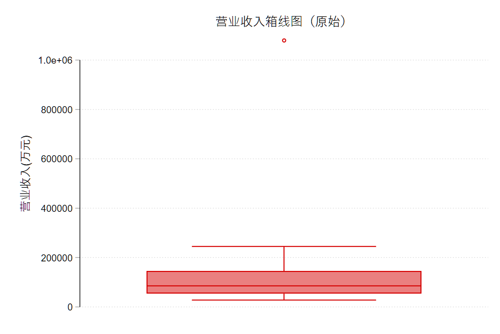
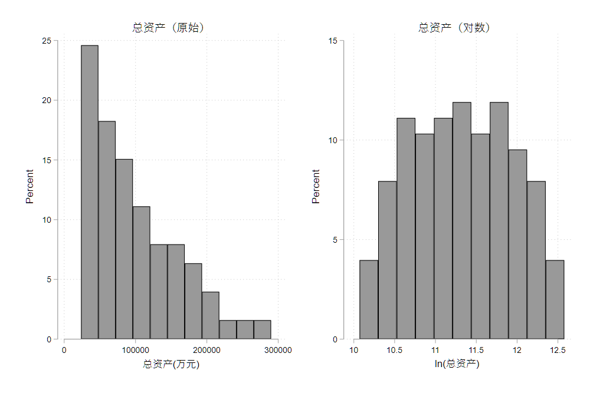
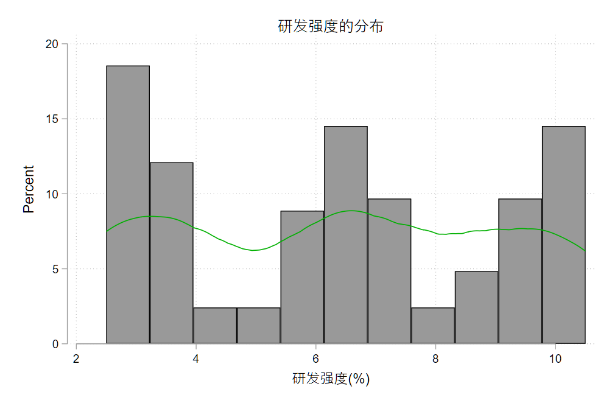
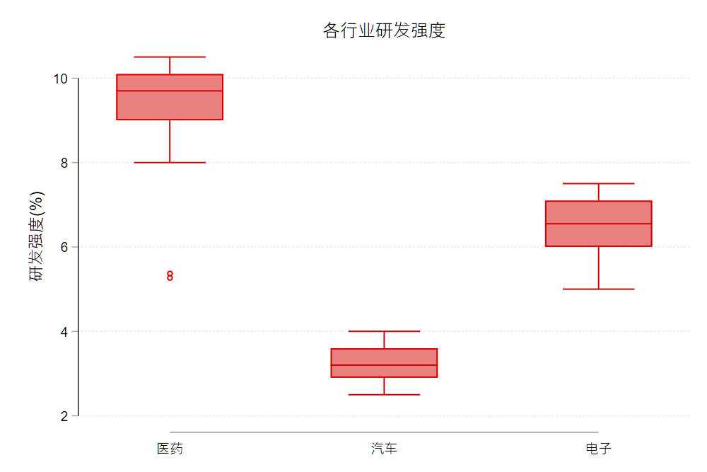
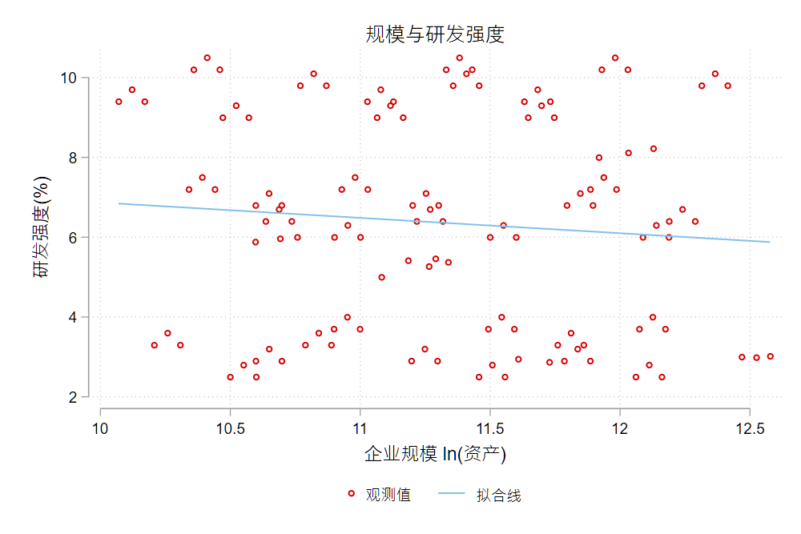
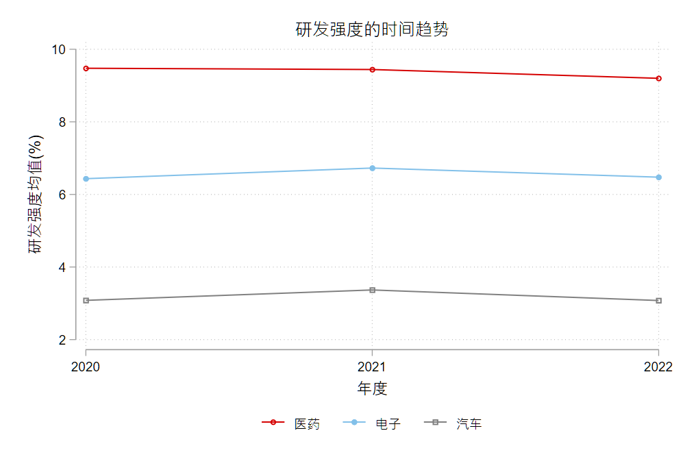
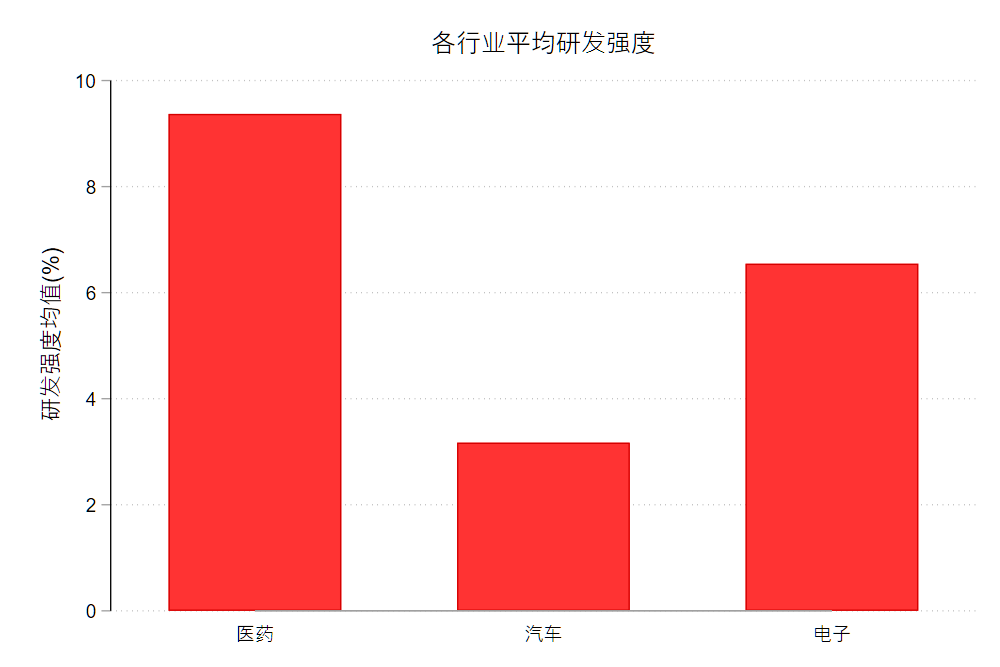

# 数据处理、探索性分析与样本构造 {#sec-02}

::: {.callout-note title="本讲要点"}
- 数据来源、数据字典和变量口径；
- 观察单位、数据颗粒度、主键和唯一性检查；
- 横截面、时间序列、面板数据和多层级数据；
- 数据合并、追加、聚合、频率转换和长宽转换；
- 缺失值、离群值、缩尾、截尾、对数转换和标准化；
- 字符变量、日期变量和简单文本变量处理；
- 探索性数据分析 (EDA)：直方图、密度图、箱线图、散点图、时间趋势图和分组均值图；
- 如何用图形检查变量分布、离群值、样本断点、组间差异和潜在样本选择问题；
- 样本筛选日志、变量字典、匹配率和样本流失检查；
- 数据处理过程的记录、复核和可复现性。
- 本讲用到的 skills：[`core/04-data-cleaning-planner`](../appendix/B_skills_index.qmd) · `core/06-repro-logger`；
- 可运行伴生文件：`examples/ch02/ch02_main.do`、`examples/ch02/ch02_python.ipynb`。
:::

::: {.callout-tip title="课堂运行方式"}
在仓库根目录打开 Stata 后，先执行 `cd "examples/ch02"`，再运行 `do ch02_main.do`。该 do 文件默认从 GitHub 读取三份教学数据，因此不必另行下载；若已克隆仓库，也可以把开头的全局宏 `D` 改为本地 `examples/ch02/data` 路径。运行时会生成 `firm_finance_2021_2022.dta` 和 `industry_lookup_upper.dta` 两个教学中间文件，它们不是原始数据，也不会纳入仓库。
:::

<!-- W2：本章采用「跟着一份数据走一遍」模式。脊柱数据见 examples/ch02/data/README-数据说明.md；节级大纲见 working/progress/ch02.md。中文段落一律整段单行 (不硬换行，避免 CJK 渲染空格)。 -->

## 一份数据的旅程

小林是一名经济学研究生。她想弄清一个并不复杂的问题：**制造业上市公司的研发投入，是不是随着企业规模变大而变化，并且因行业而异？** 问题不难，难的是——要回答它，她得先有一张干净的数据。

她手上的原始文件是这样几份：

- `firm_finance_2021.dta`、`firm_finance_2022.dta`——两批分开导出的公司财务表；
- `industry_lookup.dta`——一张行业代码对照表，同门整理后发来的；
- `mktcap_monthly.dta`——公司月度市值表，一家公司一年有十二行。

打开一看，问题不少：研发支出这一列，有的是空的，有的写着 `-99`；资产负债率不是数字，而是 `"38.2%"` 这样的文字；同一家公司的证券代码，在财务表里是 `000101`，到了市值表里却变成了 `101`——前导零悄悄没了；月度市值表里，一家公司一年十二行，而财务表里一年只有一行，两张表根本不在一个「颗粒度」上。

这些看起来都是「小毛病」。但正是这些小毛病，决定了最后能不能得到一份**可信**的数据。若对它们视而不见、直接开始 `merge`、`reg`，样本量可能莫名其妙地翻倍或腰斩，某个系数可能被一个录错的数字带偏，而你甚至不知道是哪一步出了错。

**这一讲，我们就把这段路完整走一遍**：从这几份凌乱的原始表，走到一张「一家公司一年一行、变量口径清楚、可以直接跑回归」的干净面板。沿途我们会不断停下来问同一类问题——不是「这条命令怎么写」，而是「这一步我在做什么判断，做完怎么知道自己没做错」。

一路上要回答的问题，串起来就是本讲的地图：

- 这份数据从哪来、每个变量到底量的是什么？(来源、口径与数据字典)
- 一行代表什么、这几张表能不能对齐？(观察单位、粒度与数据形态)
- 怎么把它们**正确地**拼成一张表，合并之后样本为什么变了？(合并、追加与聚合)
- 哪些变量不能直接用、该怎么处理？(缺失、离群与变换)
- 字符和日期这类「非数值」变量怎么办？
- 怎么用图形给数据做一次体检？(探索性分析与图形诊断)
- 怎么把整个过程记录下来，让别人 (和半年后的自己) 能复现？(日志、字典与匹配率)
- 最后，把这套做法用到一篇顶刊论文 Lane (2025) 的真实数据上，我们能不能复现它的数据处理、并验证结果？

::: {.callout-important title="本章怎么读：从「记命令」到「调技能」"}
过去学数据处理，学的是一串命令：`merge`、`reshape`、`winsor2`、`destring`……记住语法，套到数据上。

在 AI 和 Agent 辅助下，重点变了。你**不必**先背下每条命令的写法，但你**必须**能做到三件事：认清自己面对的是**哪一类**数据处理问题、把这个任务**描述清楚**、再调出合适的 **skill** 帮你完成——手头没有现成提示词时，还知道去哪里搜索和安装。可以这样理解：在 Agent 模式下，一个 skill 就相当于过去若干条命令的「有序打包」。

所以本章每遇到一类任务，都会用同一个小循环来讲：**a. 场景** (为什么此刻需要它)→ **b. 直觉** (讲人话、给直觉)→ **c. 最小操作** (一两行看得懂的代码)→ **d. 怎么检查** (结果对不对)→ **e. 常见坑** (真实的翻车)。并在关键处配一个 callout 框，写清**提示词**和该调用的 **skill**。命令会忘，判断和这套工作方式不会。
:::

还有一层意思，得在开头就挑明。这一整讲讲的常见操作、适用场景和陷阱，说到底都是为了**安全地借 skills 和 agent 来清洗数据**做准备。有了 AI，写清洗代码的门槛低了，风险却换了地方：agent 可能投机取巧，甚至为了凑出你后面想要的回归结果，在数据清洗和变量构造阶段悄悄做手脚。所以你得有警惕心，也得守住几条不可破除的红线——本讲末尾会把这些红线，连同「面对不同数据该调哪个 skill」一并交给你。前面每一节要练的判断，都是为了让你有能力看穿 agent 有没有偷工减料。

> 还记得上一讲打开 Lane (2025) 复现项目时，那一堆文件夹和脚本吗？本讲要补上的，正是其中最耗时、也最容易出错的一环：**原始数据究竟怎么变成分析数据**。相关背景见 [第 1 讲](01_replication.qmd)。

## 动手之前先问三件事

拿到数据就急着 `merge`、急着 `reg`，是初学者最常见、也最贵的错。有经验的研究者会先停下来，问三件事：这份数据从哪来？每个变量到底量的是什么？有没有一份写清楚这些的说明书？在此之前，还有一件更基础的事——先把项目文件夹摆好。

### 先把项目文件夹摆好

很多人的数据处理，一开始就乱在文件夹上：原始数据、改了一半的数据、结果图表全堆在一个目录里，几个月后连哪份是原始数据都认不出。动手之前，先把项目结构摆好，这不是可选项，是可复现的地基。一个朴素好用的结构：

```
project/
├── data_raw/     原始数据，只读，永不手动修改
├── data_clean/   清洗好、可直接分析的数据
├── code/         清洗与分析的 do 文件(按阶段编号：01_clean.do、02_merge.do…)
├── output/       图表与结果
└── README.md     数据来源、处理顺序、变量定义
```

最该记住的一条铁律：**`data_raw/` 只读，永不手动改**。所有清洗都写成 do 文件、结果另存到 `data_clean/`；哪怕处理逻辑错了，原始数据永远能回溯重来。真正需要反复修改和保存的，是代码和 README，不是数据本身。这条习惯，本讲最后一节还会落到「留痕」上再讲一遍。

### 数据从哪来

同样叫「企业规模」，统计年鉴里的口径和上市公司年报里的口径可能完全不同；同样一个变量，公开调查数据和商业数据库的可得性、清洗程度、使用许可也各不相同。**来源，决定了数据的口径、质量、边界和你能不能公开它**。经管社科研究中，数据大致来自四类渠道：

- **公开统计**：统计年鉴、国家统计局、世界银行 WDI 等，多为宏观或地区层面；
- **微观调查**：CFPS、CHFS、CGSS 等入户或抽样调查，个体或家庭层面；
- **商业数据库**：CSMAR、Wind、GTA 等，上市公司财务、治理、市场数据的主要来源；
- **文本与网络数据**：公告、新闻、政策文件、网页抓取等非结构化来源。

> 每一类的具体获取方法 (接口、下载、抓取、清洗) 本讲不展开，详见 [金融数据分析讲义-数据获取](https://lianxhcn.github.io/dsfin/Lecture/data_get_data/lecture_get_data.html)。本讲的重点，是拿到数据之后怎么判断和处理。

本讲这份数据就横跨了两类来源：财务表来自商业数据库导出，行业对照表由他人整理。**来源一杂，格式和口径就容易打架**——这也正是后面各种毛病的根源。

### 变量口径

口径，就是「这个变量到底量的是什么、怎么量的」。它常常藏在一个看似清楚的变量名背后：

- 「研发支出」是财报里**费用化**的研发费用，还是**含资本化**的研发投入总额？两者能差出不少；
- 「规模」用总资产、营业收入，还是员工人数？换一个，结论可能就变；
- 「资产负债率」是百分数 (`45.3`) 还是小数 (`0.453`)？单位不统一，一取对数就出错。

口径不清，后面所有的处理和回归都建在流沙上。所以**动手之前，先把每个关键变量的口径钉死**。

### 数据字典

把上面这些「口径」逐一写下来，就成了一份**数据字典** (codebook)：每个变量的名称、含义、单位、来源、口径和取值范围。它是一份数据最重要、却最常被跳过的文档。给上面那份财务表配一份字典，开头几行大概是这样：

| 变量 | 含义 | 单位 | 来源 | 口径 |
|---|---|---|---|---|
| `stkcd` | 证券代码 | —— | 商业数据库 | 6 位，含前导零 |
| `sales` | 营业收入 | 万元 | 商业数据库 | 合并报表口径 |
| `rd` | 研发支出 | 万元 | 商业数据库 | 费用化，缺失以 -99 标记 |
| `lev` | 资产负债率 | % | 商业数据库 | 期末，负债/资产 |

**没有数据字典的数据，是一颗定时炸弹**：你今天记得 `rd` 的缺失是 `-99`，三个月后就未必了。

::: {.callout-tip title="AI 协作：让 AI 生成数据字典初稿，你来核对"}
数据字典不必从零手写。把原始表头和你了解的口径交给 AI，让它先起一稿，你再逐行核对补全——生成靠 AI，判断靠你。

**任务说明书 (提示词模板)**：

```
你是我的数据助手。下面是一份上市公司财务数据的变量清单(表头 + 前 5 行)：
[粘贴 describe 或前几行]
请据此生成一份数据字典草稿，列出每个变量的：中文含义、推测单位、可能的口径、取值范围
与异常值提示(如负值、明显离群、以特殊值标记的缺失)。凡是你不确定的口径，请单独标出、
让我确认，不要替我编造。
```

**推荐 skill**：`core/04-data-cleaning-planner`(数据清洗计划师)。**没有合适的提示词？** 去 [附录 A 提示词模板](../appendix/A_prompt_templates.qmd) 取用，或用 `find-skills` 检索、安装社区里的同类技能。
:::

注意这里已经发生的转变：过去你要记住 `codebook`、`describe` 这些命令；现在你要会的，是**把「我需要一份数据字典」这件事描述清楚**，让 skill 帮你生成，再用你的专业判断把关。带着这份写好的字典，我们才敢去动下一步——先看清，这几张表到底长什么样。

## 认清你的数据

合并之前，先要看懂手里的每一张表**到底是什么**。这一步几乎不写代码，却决定了后面每一步是否走对。要问三个问题：一行代表什么？用什么能唯一确定一行？这是哪一类、哪一种形态的数据？

本讲的数据存放在课程 GitHub 仓库，可以**直接联网调取，无需克隆本仓库**。下面先约定一个数据路径全局宏 `$D`，后续各例都从它读取：

```stata
* 本讲数据(联网直接读取；若已克隆仓库，可把网址改成本地路径)
global D "https://raw.githubusercontent.com/lianxhcn/PXa2026a/main/examples/ch02/data"
```

其中 `firm_finance_2021.dta` 收录 2020–2021 两年、`firm_finance_2022.dta` 收录 2022 年，是分两次导出的两批；下面先看第一批。

### 观察单位与粒度

先把表读进来，看它的结构和头几行：

```stata
use "$D/firm_finance_2021.dta", clear
describe
list in 1/4, clean noobs
```

```
Variable    Storage   Display    Variable label
  name        type    format
------------------------------------------------
stkcd        str6     %9s        证券代码
year         int      %8.0g
sales        double   %10.0g     营业收入(万元)
rd           double   %10.0g     研发支出(万元)
at           double   %10.0g     资产总额(万元)
lev          str8     %9s        资产负债率(文本)
indcd        str5     %9s        行业代码

  stkcd   year   sales     rd      at     lev   indcd
 000101   2020   82000   4100   65000   38.2%     C39
 000101   2021   96000   5200   72000   41.0%     C39
 000102   2020   51000   3000   40000   52.4%     C39
 000102   2021   57000   3400   44000   50.8%     C39
```

一行是**一家公司在某一年**的记录——`000101` 在 2020、2021 各占一行。我们把「一行代表什么」叫作数据的**观察单位**，把它的粗细叫作**粒度** (granularity)。这张表的粒度是「公司-年度」。

粒度是数据处理里最容易被忽略、又最容易出错的概念。对照另外两张表就清楚了：行业对照表 `industry_lookup.dta` 一行是**一个行业** (粒度更粗)，月度市值表 `mktcap_monthly.dta` 一行是**一家公司的某一个月** (粒度更细)。**粒度不同的表不能直接合并**——这是下一节反复要处理的问题，这里先记住：动手合并前，先说清每张表的一行是什么。

### 主键与唯一性

能唯一标识一行的变量组合，叫**主键**。财务表的主键是「证券代码 + 年度」这一对，而不是证券代码本身。这不是凭感觉，而是要**查**：

```stata
duplicates report stkcd year
duplicates report stkcd
```

```
Duplicates in terms of stkcd year
   Copies |   Obs   Surplus
----------+-----------------
        1 |    84         0      <- 每个 (stkcd, year) 只出现 1 次：唯一

Duplicates in terms of stkcd
   Copies |   Obs   Surplus
----------+-----------------
        2 |    84        42      <- 每个 stkcd 出现 2 次(两年)：单独不唯一
```

`stkcd year` 的 Surplus 为 0，说明这对组合唯一，可以作主键；`stkcd` 单独的 Surplus 是 42，因为一家公司横跨两年。**如果误把 `stkcd` 当主键去做一对一合并，样本就会错乱**。想更严格，可以用 `isid`：

```stata
isid stkcd year    // 若不唯一会直接报错，把问题挡在合并之前
```

真实数据里，主键不唯一往往来自导出重复或口径不清；养成「合并前先查唯一性」的习惯，能挡掉后面一大半的样本量异常。

### 横截面、时序、面板与多层级

同样几张表，还可以按「有没有单位维度、有没有时间维度」分类：

- **横截面**：一个时点、多个单位。`industry_lookup` 就是——一行一个行业，没有时间。
- **时间序列**：一个单位、多个时点。比如单看某一家公司逐年的营收。
- **面板**：多个单位 × 多个时点。财务表就是——多家公司、多年，兼有两个维度。
- **多层级**：单位嵌套在更大的单位里。公司嵌套在行业、省份中，就是两层结构 (`industry_lookup` 正是把公司连到行业层的桥)。

分清类型，才知道能用什么工具。面板数据要用 `xtset` 声明个体和时间，之后才能算滞后、增长率、组内变化。不过 `xtset` 要求个体编号是**数值**，而这里的 `stkcd` 是字符——这个矛盾留到清洗时解决，先记下：**声明面板结构，是面板分析的第一步**。

### 扁平 (wide) 与长条 (long)

最后一个要练出直觉的，是数据的形态。看一个小例子——三个人、三年的收入 `inc` 和失业状态 `ue`，一开始长这样，是「扁平型」:

```stata
list, clean noobs
```

```
    id   sex   inc80   inc81   inc82   ue80   ue81   ue82
     1     0    5000    5500    6000      0      1      0
     2     1    2000    2200    3300      1      0      0
     3     0    3000    2000    1000      0      0      1
```

扁平型 (wide) 一行是一个个体，不同年份摊成不同列 (`inc80`、`inc81`……)。可大多数面板分析要的是「长条型」，用 `reshape` 转过去:

```stata
reshape long inc ue, i(id) j(year)
list in 1/9, clean noobs
```

```
    id   year    inc   ue   sex
     1     80   5000    0     0
     1     81   5500    1     0
     1     82   6000    0     0
     2     80   2000    1     1
     2     81   2200    0     1
     2     82   3300    0     1
     3     80   3000    0     0
     3     81   2000    0     0
     3     82   1000    1     0
```

转完之后，一行变成「一个人在某一年」，`inc`、`ue` 各成一列，年份进了 `year` 列。识别的窍门只有一句：看同一个个体是不是占了多行——占多行是长条，一行摊成多列是扁平。为什么要分清？大多数面板分析要长条型，而从网页、报表、问卷导出的原始数据常常是扁平的。本讲的财务表本就是长条的 (`000101` 两年占两行)；`reshape` 在真实面板上的更多用法，见下一节。

::: {.callout-tip title="AI 协作：让 agent 先探索数据形态，再交你审"}
面对一堆来路不明的表，与其逐张手动 `describe`，不如让 agent 先跑一遍、把判断汇成一张**待审清单**，你只需确认或纠正，再决定怎么处理。这正是 AI 工作流的关键——**先自动探索、生成清单，人确认后再动手**，而不是让 agent 直接改数据。

**任务说明书 (提示词模板)**：

```
这里有若干 .dta / .csv 数据表：[列出文件]。请对每一张表逐一探索并报告，汇成一张待审清单：
(1) 观察单位与粒度(一行代表什么)；
(2) 主键候选(哪几个变量组合能唯一确定一行，并给出唯一性检查结果)；
(3) 数据形态(长条 long 还是扁平 wide)；
(4) 潜在问题：重复行、异常缺失、同名键的存储类型或大小写是否一致、粒度是否不齐。
只报告与提问，不要修改任何数据。我确认后再决定处理方式。
```

**推荐 skill**：`core/04-data-cleaning-planner`。**没有合适提示词？** 见 [附录 A](../appendix/A_prompt_templates.qmd) 或用 `find-skills` 检索安装。
:::

看清了每张表是什么、粒度粗细、主键和形态，我们才有把握做下一件、也是数据处理里最容易翻车的事：把这几张表**正确地**拼成一张。顺带说一句，本讲最后会把这套「先看清结构」的做法，用到 Lane (2025) 那份真实的行业-年度面板上——你会发现，顶刊的分析数据，结构上和这里的财务面板并无二致。

## 合并、追加与聚合

把几张零散的表拼成一张分析面板，是数据处理里最耗时、也最容易翻车的一步。动手之前，先分清三类操作——它们改变数据的方式完全不同：

- **追加 (append)**：两张结构相同的表首尾相接，**行**变多 (如分批导出的数据)；
- **合并 (merge)**：按键把另一张表的列贴过来，**列**变多 (如把行业名贴到公司上)；
- **聚合 (collapse)**：把细粒度压成粗粒度，行变少、**粒度**变粗 (如把月度压成年度)。

一句话记忆：**加行用 append，加列用 merge，改粒度用 collapse**。分不清这三者，就会用错工具、炸错样本。

### 追加 (append)

财务表是分两批导出的，先把它们摞成一张完整面板：

```stata
use "$D/firm_finance_2021.dta", clear
count
append using "$D/firm_finance_2022.dta"
count
isid stkcd year
tab year
save "firm_finance_2021_2022.dta", replace  // 伴生 do 文件后续从这里读入
```

```
    84                              <- 追加前：84 行(2020–2021)
   126                              <- 追加后：126 行(多出 2022 的 42 行)

       year |      Freq.   Percent
------------+--------------------
       2020 |         42     33.33
       2021 |         42     33.33
       2022 |         42     33.33
```

追加后行数从 84 变 126，`isid stkcd year` 没报错、`tab year` 三年各 42 家，说明摞得干净。**append 有两个前提**：两张表的变量要**同名**，且同名变量的**存储类型要一致**——若一份的 `lev` 是数值、另一份是字符，追加要么报错、要么把两列错误地并在一起。所以追加后，`count` 和 `isid` 是必做的两道检查。

### 关联变量 (key)

`merge` 靠一个 (或一组) **键变量**把两张表对齐。初学者一大半的合并事故，都出在键上。把原则列成一张清单，动手前逐条对照：

- **a. 键要同名**——`merge` 按同名变量对齐，两表的键必须叫同一个名字；
- **b. 大小写、空格敏感**——`"C36"` 和 `"c36 "` 是两个不同的键，差一个空格就对不上；
- **c. 存储类型一致**——字符键和数值键对不上 (后面月度表就栽在这一条)；
- **d. 主键唯一**——做一对一 (`1:1`) 合并前，先 `isid` 或 `duplicates report` 查唯一性；
- **e. 编码、前导零一致**——`"000101"` 和 `101` 不是同一个键；
- **f. 合并后必查匹配率**——用 `_merge` 看谁没匹配上，别急着往下走。

这六条，正好对应本讲数据里埋着的几处毛病。下面就撞上其中两条。

### 横向合并 (m:1)

合并之前，先分别看清两份数据，尤其是那个关联的键。主表这边，每行是一个公司-年度，键是行业代码 `indcd`:

```stata
list stkcd year indcd in 1/6, clean noobs
```

```
     stkcd   year   indcd
    000101   2020     C39
    000101   2021     C39
    000102   2020     C39
    000102   2021     C39
    600201   2020     C27
    600201   2021     C27
```

对照表那边，每行是一个行业，键同样是 `indcd`:

```stata
use "$D/industry_lookup.dta", clear
list, clean noobs
```

```
    indcd                            indname
      C39   计算机、通信和其他电子设备制造业
      C27                         医药制造业
     c36                          汽车制造业
```

两份数据粒度不同 (一个是公司-年度、一个是行业)，靠 `indcd` 把行业名贴到每个公司-年度上，这是多对一 (`m:1`) 合并。但动手前务必盯住键：主表里是 `"C36"`，对照表里却写成了小写带空格的 `"c36 "`——就这一点差别，足以让合并悄悄出错。**数据合并十有八九，栽在没吃透两份数据、尤其没对齐键上。** 先直接合并，看它怎么栽:

```stata
use "firm_finance_2021_2022.dta", clear
merge m:1 indcd using "$D/industry_lookup.dta"
tab _merge
list stkcd year indcd _merge if _merge==2   // 看那条用不上的脏键
```

```
    Result                      Number of obs
    -----------------------------------------
    Not matched                            43
        from master                        42  (_merge==1)
        from using                          1  (_merge==2)
    Matched                                84  (_merge==3)
    -----------------------------------------

   Matching result from merge |   Freq.   Percent
------------------------------+------------------
              Master only (1) |     42     33.07
               Using only (2) |      1      0.79
                  Matched (3) |     84     66.14

     stkcd   year   indcd            _merge
         .      .    c36     Using only (2)
```

只有 84 行匹配上，**匹配率 84/126 ≈ 67%**。两类没匹配上的行泄露了原因：42 行 `C36` 的公司是 master only(面板里有、对照表里没有)，而那条 `c36` 是 using only(对照表里有、面板里用不上)。一对照就明白——对照表里汽车业的键写成了小写带空格的 `"c36 "`，和面板里的 `"C36"` 对不上。**那条 using-only 记录，就是「键没洗干净」最典型的信号。**

把键洗干净 (转大写、去空格)，再合并一次：

```stata
use "$D/industry_lookup.dta", clear
replace indcd = upper(strtrim(indcd))   // "c36 " -> "C36"
save "industry_lookup_upper.dta", replace

use "firm_finance_2021_2022.dta", clear
merge m:1 indcd using "industry_lookup_upper.dta"
tab _merge
```

```
    Result                      Number of obs
    -----------------------------------------
    Not matched                             0
    Matched                               126  (_merge==3)
    -----------------------------------------
```

126 行全部匹配，**匹配率 100%**。请把顺序记牢：**`merge` 之后第一件事就是 `tab _merge` 看匹配率**；匹配率偏低，几乎总是键的问题，先回头洗键，别让缺胳膊少腿的数据流到回归里。

::: {.callout-tip title="AI 协作：让 AI 复核 merge / join 逻辑"}
合并前，把两张表的粒度、键和合并类型描述给 AI，让它先替你把关——尤其是 `1:1` 还是 `m:1`、键要不要先清洗、合并后该期望多少匹配率。判断仍由你拍板，但 AI 能提前拦下大多数低级错。

**任务说明书 (提示词模板)**：

```
我要把两张表合并。表 A：[粒度、主键、行数]；表 B：[粒度、主键、行数]。
我打算用 [键] 做 [1:1 / m:1] 合并。请检查：
(1) 这个合并类型对不对？两边键的唯一性是否支持它？
(2) 两边的键在名称、大小写、空格、存储类型、前导零上是否一致？可能哪里对不上？
(3) 合并后我应该预期多大的匹配率？出现 master-only / using-only 各说明什么？
只做检查与提问，先不要写最终代码。
```

**推荐 skill**：`core/04-data-cleaning-planner`。**没有合适提示词？** 见 [附录 A](../appendix/A_prompt_templates.qmd) 或用 `find-skills` 检索安装。
:::

### 聚合与频率转换

月度市值表 `mktcap_monthly` 要并进公司-年度面板，可两张表的**粒度不一样**：一个是公司-月，一个是公司-年度。这时候最常见的翻车，就是不管粒度直接合并。先验证一下月度表到底是什么粒度：

```stata
use "$D/mktcap_monthly.dta", clear
gen int year = int(ym/100)      // 202103 -> 2021
duplicates report stkcd year
```

```
Duplicates in terms of stkcd year
   Copies | Observations   Surplus
----------+------------------------
       12 |          504       462      <- 一个公司-年度有 12 行：远非唯一
```

一个「公司-年度」占了 12 行 (12 个月)。若强行按 `stkcd year` 做 `1:1` 合并会直接报错；若用 `m:1`、`m:m` 硬合，则会把面板炸成一堆重复行。**正确的顺序是：先把月度聚合到公司-年度 (这一步既是频率转换，也是聚合)，再合并。**

```stata
collapse (mean) mktcap, by(stkcd year)   // 月 -> 年，取年均市值
duplicates report stkcd year             // 现在唯一了
tostring stkcd, replace format(%06.0f)   // 数值 101 -> 字符 "000101"，补回前导零
list in 1/3, clean noobs
```

```
Duplicates in terms of stkcd year
   Copies | Observations   Surplus
----------+------------------------
        1 |           42         0      <- 聚合后：公司-年度唯一

     stkcd   year      mktcap
    000101   2021   391.28333
    000102   2021   223.25833
    000201   2021   658.84167
```

这里顺手补上了 key 原则的第 c、e 条：月度表的 `stkcd` 存成了**数值** `101`，和面板里的**字符** `"000101"` 类型不同、还丢了前导零，`tostring ... format(%06.0f)` 把它转回六位字符键。到这一步，聚合后的年度市值已是干净的公司-年度粒度、键也对得上，再 `merge 1:1 stkcd year` 就能安全并入主面板 (本例市值只覆盖 2021 年，并入后其余年份的市值为缺失，这也是真实数据的常态)。

### 长宽转换 (reshape)

有时还要在**长条**与**扁平**之间来回变形。把面板的营收摊成「每公司一行、各年一列」，用 `reshape wide`：

```stata
use "firm_finance_2021_2022.dta", clear
sort stkcd year
list stkcd year sales in 1/6, sepby(stkcd)
keep stkcd year sales
reshape wide sales, i(stkcd) j(year)
list in 1/2, clean noobs
```

```
     stkcd   sales2020   sales2021   sales2022
    000101       82000       96000      108000
    000102       51000       57000       61000
```

`reshape long sales, i(stkcd) j(year)` 再变回长条。记住两个选项：`i()` 是**保持不变的个体**，`j()` 是**要摊开或合拢的维度**。大多数面板分析要长条型，而从网页、报表导出的数据常是扁平的，`reshape` 就是两者之间的桥。

到这里，几张零散的表已经拼成一张「公司-年度、带行业名、带年度市值」的面板。回头看，每一步靠的都不是记住某条命令，而是**先想清粒度和键、动手后用 `isid`、`_merge`、`duplicates` 去查**。本讲最后复现 Lane (2025) 的数据时，你会看到同样的动作：把政策行业交叉表按行业代码 `merge` 进面板——键就是行业代码，检查方式一模一样。

## 变量能直接用吗

表拼好了，变量却未必能直接进回归。这一节处理四件事——缺失、离群、对数、标准化——它们有一个共同的做法：**先看，再决定，尤其是先画图**。判断永远在动手之前。下面接着上一节 `append` 好的面板往下做，并把绘图模板设为 `cleanplots`(`ssc install cleanplots` 一次即可)。

```stata
set scheme cleanplots
```

### 缺失值

财务表的 `rd` 有的是空、有的写着 `-99`。这个 `-99` 是**人为标记的缺失，却伪装成一个数字**——若不处理，它会被当成真实研发支出，算进均值、跑进回归。第一步是把它还原成真正的缺失：

```stata
mvdecode rd, mv(-99)      // 把 -99 全部替换为缺失 .
count if missing(rd)
misstable summarize rd, all
```

```
rd: 1 missing value generated
    2                              <- rd 现在共有 2 个缺失(原本的空 + 还原的 -99)

               |                                | Unique
      Variable |     Obs=.     Obs>.     Obs<.  | values     Min      Max
  -------------+--------------------------------+----------------------
            rd |         2                 124  |    121      993    21936
```

这里藏着一个经典的坑：**在 Stata 里，缺失 `.` 大于任何数字**。所以 `count if rd>10000` 会把缺失也数进去，`keep if rd<.` 之类的写法必须小心。好在 `summarize`、`regress` 这些命令会自动忽略缺失——但 `count`、`keep` 不会。先把伪装的缺失还原，是一切的前提。

### 离群值

`sales` 里可能有异常大的值。先看统计量，再画图：

```stata
summarize sales, detail
histogram sales, percent xtitle("营业收入(万元)")
graph box sales
```

```
                    营业收入(万元)
-------------------------------------------------
              Percentiles      Largest
50%            85370.5         231000
75%           145827           242112       Mean       109905.8
95%           223839           245000       Skewness     6.348803
99%           245000          1080000       Kurtosis    58.35257
```



偏度高达 6.35、箱线图上那个孤零零飞出去的点，都在喊「这里有离群值」。但**离群不等于错误**——处理之前，必须先查清它到底是什么：

```stata
list stkcd year sales if sales>500000, clean noobs
```

```
     stkcd   year     sales
    000101   2022   1080000
```

这是 `000101` 在 2022 年的营收。它别的年份都在 10 万上下，这里却是 108 万——**多打了一个 0，是录入错误**。对于这种能查明的错误，正确的做法是**改对它**，而不是缩尾：

```stata
replace sales = 108000 if stkcd=="000101" & year==2022
```

只有对**无法核实、但确实极端**的值 (不是错误，就是天生很大或很小)，才轮到缩尾和截尾出场：

```stata
winsor2 sales, cuts(1 99)     // 缩尾：把 1%/99% 之外的值拉回分位点，样本量不变
winsor2 sales, cuts(1 99) trim // 截尾：直接删掉极端值，会损失样本
```

**缩尾**把过大过小的值拉回到分位点上，保留样本量；**截尾**干脆删掉它们，样本变少。二者都不该在「看图、查明」之前就无脑套用——否则要么掩盖了本可修正的错误，要么扭曲了真实的分布。顺序永远是：**先画图 → 查明来源 → 能改的改，改不了的再缩尾或截尾**。

需要说明的是，对于离群值，不同的研究领域会有不同的主流处理方式。

- 在研究偏宏观的问题时，比如说城市或省级数据，主要是采用对数转换。因为这类数据通常都是经过微观数据加总后得到的，其数据本身不太可能存在离群值。之所以进行对数转换，主要是因为从理论模型向计量模型转换时做了对数变换 (比如说最典型的 CD 生产函数)。因此，严格来讲，这类计量模型里边的对数转换并不是为了应对离群值。
- 在偏微观的领域，比如说劳动经济学和公司金融领域，缩尾处理是非常常用的手段。比如说在公司金融领域，大量的指标都是财务比率，加之是公司层面的微观数据，所以离群值是非常普遍的。在多数的公司金融文献中，通常是对这些财务比率进行第 1 百分位和第 99 百分位的缩尾。如果你的论文中缩尾的力度比这个要更大，要给出合理的解释。

::: {.callout-tip title="AI 协作：让 AI 讲清缺失、离群、缩尾、截尾、对数的差别"}
这几个概念初学者最容易混。可以让 AI 结合你**具体的变量**把它们讲清楚，并给出何时用哪一个的判断依据——但最终用不用、怎么用，由你根据数据和研究问题决定。

**任务说明书 (提示词模板)**：

```
针对我的变量 [变量名、含义、分布特征(偏度、极值、缺失比例)]，请分别解释：
缺失、离群、缩尾(winsorize)、截尾(trim)、对数转换——各自解决什么问题、代价是什么、会如何改变后续回归系数的含义。并给出：对我这个变量，你建议先做哪一步、为什么。
不要替我下结论，把判断依据摆出来让我选。
```

**推荐 skill**：`core/04-data-cleaning-planner`。**没有合适提示词？** 见 [附录 A](../appendix/A_prompt_templates.qmd) 或用 `find-skills` 检索安装。
:::

### 对数转换

资产、营收这类变量往往**右偏**——大多数不大，少数很大。回归里常对它们取对数：

```stata
gen double size = ln(at)      // size 即「企业规模」的常用度量
histogram at, percent
histogram size, percent
```



对数把「大的压得多、小的压得少」，让右偏的分布更对称，也把变量间的乘法关系变成加法关系 (这正是弹性解释的由来)。两点要记住：**取对数后系数的含义会变** (变成半弹性或弹性)，解释要相应改口；而且 `ln()` 要求正值，`0` 和负数会变成缺失，取对数前先检查。

有关对数转换的更深层的讨论，参见如下推文：

  - 刘潍嘉, 2024, [偏态分布数据的回归模型选择](https://www.lianxh.cn/details/1405.html).
  - 匡宇驰, 2024, [log-0 问题：零值太多如何取对数？](https://www.lianxh.cn/details/1455.html).
  - 吴梦萱, 2024, [纠结！DID 中取对数还是不取对数？论文推介](https://www.lianxh.cn/details/1340.html).
  - 毕英睿, 2023, [取对数：如何应对零值和负数](https://www.lianxh.cn/details/1234.html).
  - 浦进博, 2025, [理解变量转换与非线性效应的八个基本准则](https://www.lianxh.cn/details/1612.html).
  - 秦范, 2021, [取对数！取对数？](https://www.lianxh.cn/details/615.html).


### 标准化

有时要把变量标准化到「均值 0、标准差 1」(z-score)，便于跨变量比较，或供某些方法使用：

```stata
egen z_size = std(size)
summarize size z_size
```

```
    Variable |   Obs     Mean    Std. dev.      Min        Max
-------------+------------------------------------------------
        size |   126   11.315      .625     10.070     12.578
      z_size |   126   ~0          1        -1.993      2.021
```

标准化**不改变分布的形状**，只是换了把尺子：减去均值、除以标准差，之后「一个单位」就等于「一个标准差」。

回头看这一节，没有一步是「因为命令该这么写」。每一步都是**先看** (统计量、图形)、**判断** (是错误还是真离群？要不要变换？变换后怎么解释？)、**再动手**，动手之后再回看。缺失怎么补、离群怎么处理、要不要取对数，都没有唯一正确答案，取决于你的数据和研究问题——这恰恰是研究者不能外包给 AI 的那部分判断。

## 字符与日期变量

有些变量看着是数字或日期，却以**文本**存着，直接拿去计算会报错，或者更糟——悄悄算错。这一节做三件事：把文本型数字转成数值、把字符日期转成真日期、以及对文本变量该有的意识。判断的核心始终是一句话：**先看清它现在是什么类型、该是什么类型**。

### 文本型数字 (destring)

`lev`(资产负债率) 存成 `"38.2%"`，是字符——直接求均值、跑回归都会出错。用 `destring` 转成数值：

```stata
use "$D/firm_finance_2021.dta", clear
destring lev, gen(lev_num) percent
list stkcd year lev lev_num in 1/4, clean noobs
```

```stata
lev: character % removed; lev_num generated as double

     stkcd   year     lev   lev_num
    000101   2020   38.2%      .382
    000101   2021   41.0%       .41
    000102   2020   52.4%      .524
    000102   2021   50.8%      .508
```

`percent` 选项会去掉 `%` 并除以 100，得到 0–1 的比率。但**不是所有「看着是数字」的文本都该转**。`stkcd` 也全是数字 (`"000101"`)，可它是**编号 (标签)，不是量**——`destring` 会把它变成数值 `101`，丢掉前导零，键就废了。所以规则很简单：**是「量」(要参与计算) 就转数值；是「编号、标签」就保持字符**。见到文本型数字，先问它是量还是编号，再决定动不动 `destring`。

### 类别文本 (encode)

`indcd` 的 `"C39"`、`"C27"`、`"C36"` 是类别标签。有些分析 (比如放进 `i.industry` 做固定效应) 需要**数值型**的类别。`encode` 把文本类别转成「带标签的数值」：

```stata
encode indcd, gen(ind_id)
label list ind_id
```

```
ind_id:
           1 C27
           2 C36
           3 C39
```

`encode` 自动建了一张「数字 ↔ 文字」对照表 (value label)：数据里存的是 1/2/3，显示出来还是 `C27/C36/C39`；`decode` 则反向还原。**`destring` 和 `encode` 的分工要记住**：数字被误存成文本，用 `destring`(或 `real()`) 还原；观察值本身就是文字类别，用 `encode` 给它编号。一个还原数字，一个给文字贴号。

### 日期变量

日期常以文本 (`"2021-06-30"`) 或数字 (`20210630`) 存着。要先把它变成 Stata 的**日期值**，才能排序、算间隔、按频率聚合：

```stata
clear
input str10 rptdate
"2021-06-30"
"2022-03-31"
end
gen d = date(rptdate, "YMD")   // 第二个参数告诉 Stata 顺序是「年-月-日」
format d %td                    // 显示成人类可读的日期
gen year  = year(d)
gen month = month(d)
list, clean noobs
```

```
       rptdate           d   year   month
    2021-06-30   30jun2021   2021       6
    2022-03-31   31mar2022   2022       3
```

`date(字符, "YMD")` 里的 `"YMD"` 告诉 Stata 按「年月日」解析；`format d %td` 让它显示成 `30jun2021`(内部其实是从 1960-01-01 起算的天数)；之后 `year()`、`month()`、`qofd()` 等函数随手取。两个坑：顺序参数要对 (`"YMD"` 还是 `"MDY"`)；纯数字型日期 (`20210630`) 要先 `tostring` 再 `date`，或直接用 `substr` 拆出年月日。

### 文本变量：交给 skills

传统教学到这里会讲一大套——用 `regexm`、`split`、`substr` 从「中国农业银行深圳光明支行」里抠出总行名和城市。在 AI 工作流下，你**不必**记这些代码，但**必须有意识**：认出「这是一个文本处理任务」、能把它描述清楚、调出合适的 skill 来做。

::: {.callout-tip title="AI 协作：文本处理，有意识、会描述、调技能"}
遇到公司名、地址、公告文本这类需要「从一串文字里抽取信息」的任务，别急着自己写正则，先把任务描述清楚交给 AI 与技能。

**任务说明书 (提示词模板)**：

```
我有一列公司全称，如「中国农业银行深圳光明支行」「招商银行股份有限公司兰州分行」，
想从中提取：(1) 总行名称(如「中国农业银行」)；(2) 所在城市。
请先规划处理步骤，再生成可运行代码；对拿不准的匹配规则，先列出让我确认，不要硬编造。
```

**推荐 skill**：`core/04-data-cleaning-planner`；文本量大或较专门时，用 `find-skills` 检索安装专门的文本处理技能。正则表达式与 `split` 的代码细节本讲不展开 (属传统命令教学)，延伸阅读处给链接。
:::

字符与日期处理，关键从来不是背下 `destring`、`encode`、`date` 的语法，而是先判断**它现在是什么、该是什么**——是量还是编号？是日期还是文本？判断对了，用哪条命令、哪个 skill，自然一目了然。

## 探索性分析与图形诊断

探索性数据分析 (EDA) 不是论文里那几张精修的图，而是你在**清洗和建模的每一步**都该做的体检。它的关键在一句话：**每一张图，都是为了回答一个具体的问题**。这一节把六类常用图和它们各自要查的问题对上号。

先分清两种图。**探索性图形**是画给自己看的——要快、要多、可以糙，目的是**发现问题**；**解释性图形**是画给读者看的——一张图只讲一件事、需要精修。EDA 阶段要的是前者：多画几张、快速扫过，把数据的毛病和结构看出来。

本节的图都基于上一节清洗好的面板，并构造两个变量：研发强度 `rd_ratio`(研发支出占营收的百分比) 和企业规模 `size`(资产的对数)，再按行业分组：

```stata
use "$D/firm_finance_2021.dta", clear
append using "$D/firm_finance_2022.dta"
mvdecode rd, mv(-99)
replace sales = 108000 if stkcd=="000101" & year==2022   // 修正上一节发现的录入错误
gen double rd_ratio = 100*rd/sales                        // 研发强度(%)
gen double size = ln(at)                                  // 企业规模
gen str6 ind_s = cond(indcd=="C39","电子", cond(indcd=="C27","医药","汽车"))
```

### 分布：直方图与密度图

**要查的问题：这个变量分布是什么形态？偏不偏？要不要变换？**

```stata
histogram rd_ratio, percent kdensity xtitle("研发强度(%)")
```



直方图看形状，叠加的核密度曲线 (`kdensity`) 把形态描得更平滑。这里研发强度大致落在 2%–10%，并不是单峰——隐约能看出几处聚集。这个信号提醒我们：也许背后藏着分组结构 (后面散点图会证实)。若图形明显右偏，就回到上一节考虑取对数。

### 离群与组间：分组箱线图

**要查的问题：各组的分布和离群怎样？组间有没有差异？**

```stata
graph box rd_ratio, over(ind_s)
```



一张图同时回答了两个问题。三个行业的箱体高低分明——**医药最高、电子居中、汽车最低**，组间差异一目了然；而医药组里还浮着一个孤立的点，那是这一组的离群值。`over()` 把分组直接摆在横轴上，不需要图例。

### 关系：散点图

**要查的问题：两个变量怎么关联？有没有异常点或隐藏的分层？**

```stata
twoway (scatter rd_ratio size) (lfit rd_ratio size), ///
    legend(order(1 "观测值" 2 "拟合线") pos(6) rows(1))
```



拟合线几乎水平，似乎「规模和研发强度没什么关系」——但散点暴露了一件更重要的事：所有点分成了**上、中、下三条带**，那正是三个行业。也就是说，表面上的「无关」，背后其实是**行业在主导**。散点图让你看见了这种隐藏的分层，提醒你：若不加区分地对全样本回归，很可能把行业差异误当成别的东西。这就是图形帮你发现**潜在样本结构与选择问题**的价值——比任何统计量都直观。

### 趋势：时间趋势图

**要查的问题：变量随时间怎么变？各组趋势一样吗？有没有断点？**

```stata
preserve
collapse (mean) rd_ratio, by(ind_s year)
twoway (connected rd_ratio year if ind_s=="医药") ///
       (connected rd_ratio year if ind_s=="电子") ///
       (connected rd_ratio year if ind_s=="汽车"), ///
    legend(order(1 "医药" 2 "电子" 3 "汽车") pos(6) rows(1)) xlabel(2020 2021 2022)
restore
```



三个行业的研发强度逐年都很平稳、层次稳定。真正要警惕的是**突变**：如果某一年出现跳变，就得回头查清楚——是政策冲击、是统计口径变了，还是数据出了错 (样本断点)。趋势图正是用来第一时间发现这种断裂的。

### 组间均值：分组均值图

**要查的问题：各组的平均水平差多少？**

```stata
graph bar (mean) rd_ratio, over(ind_s) ytitle("研发强度均值(%)")
```



把箱线图的「分布」进一步压成「一个数」：医药 9.37%、电子 6.55%、汽车 3.17%(对应 `tabstat rd_ratio, by(ind_s)`)，组间高下立判。分组均值图适合快速比较组间水平，但也因为只剩一个数，会**掩盖组内的离散和离群**——所以它常和箱线图搭配使用，一个看水平、一个看分布。

### 一图一问清单

回过头看，六类图各司其职，对应着数据处理里最该盯的几个问题：

| 要查什么 | 用哪张图 |
|---|---|
| 分布形态、要不要变换 | 直方图 / 密度图 |
| 离群值 | 箱线图 |
| 组间差异 | 分组箱线图 / 分组均值图 |
| 两变量关系、异常点、隐藏分层 | 散点图 |
| 时间变化、样本断点 | 时间趋势图 |
| 潜在样本结构与选择 | 分组散点 / 分组密度 |

::: {.callout-tip title="AI 协作：让 AI 按变量类型建议该画哪些图"}
不确定一个变量该画什么图来检查，就把它的类型和你关心的问题交给 AI，让它列一份 EDA 图形清单，并说明每张图能查出什么。

**任务说明书 (提示词模板)**：

```
我有以下变量：[逐个列出：名称、类型(连续/类别/时间)、含义]，研究问题是 [一句话]。
请建议一套探索性图形(EDA)清单：每一项写清「画哪种图、对哪些变量、能帮我检查什么问题」，
并优先安排最可能暴露数据问题(离群、缺失、分组结构、样本选择)的图。
给出可运行的 Stata 代码骨架，图例统一放图形下方。
```

**推荐 skill**：`core/04-data-cleaning-planner`。**没有合适提示词？** 见 [附录 A](../appendix/A_prompt_templates.qmd) 或用 `find-skills` 检索安装。
:::

一句话收束：EDA 的精髓是**一图一问**——先想清要检查什么，再选图；图是用来**发现问题**的，不是用来装饰论文的。清洗、变换、建模的每一步，都该顺手画一张图回头看看。

## 留痕与可复现

一份干净的面板有了。可如果别人 (或半年后的你) 问一句：这张表怎么来的？样本为什么正好是这么多？每个变量什么口径？——你答得上来吗？答不上来，就等于不可复现。这一节讲三样必须**随数据一起留下**的东西：样本筛选日志、变量字典、匹配率与样本流失，外加两条最省心的习惯。

### 样本筛选日志

从原始数据走到分析样本，每筛一次就记一笔——留下「样本量是怎么变的」这本账。做法很朴素，就是在每一步后 `count`：

```stata
use "$D/firm_finance_2021.dta", clear
append using "$D/firm_finance_2022.dta"
count                                                     // 步骤 0
mvdecode rd, mv(-99)
replace sales = 108000 if stkcd=="000101" & year==2022    // 修正录入错误，不删样本
gen double rd_ratio = 100*rd/sales
drop if missing(rd_ratio)
count                                                     // 步骤 1
```

把这些数整理成一张筛选日志：

| 步骤 | 操作 | 样本量 | 变化 |
|---|---|---:|---:|
| 0 | 追加两批财务表 | 126 | — |
| 1 | 剔除研发支出缺失 | 124 | −2 |
| 2 | 合并行业名 (匹配率 100%) | 124 | 0 |

注意那条离群的营收 (`000101`) 是**修正**、不是删除，所以样本量不减。有了这本账，「样本为什么是 124」一目了然，审稿人问起一句话答清；反过来，若哪一步样本莫名掉了一大截，日志会第一时间报警。

### 匹配率与样本流失

`merge` 是最容易悄悄丢样本的地方，所以每次合并后都记下 `_merge` 的分布 (匹配率) 和前后行数：

```stata
merge m:1 indcd using "industry_lookup_upper.dta"
tab _merge
```

```
   Matching result from merge |   Freq.   Percent
------------------------------+------------------
                  Matched (3) |    124    100.00
```

这次匹配率 100%、零流失。回想上一节：同样的合并，脏键时匹配率只有 67%——那不是数据少了，而是键没洗干净。**若匹配率偏低又没有记录，你很可能拿着缺了三分之一的样本还浑然不觉。** 匹配率就是合并这一步的安全带。

### 变量字典

给分析样本里的关键变量做一张字典，交代 N、取值范围和含义。`codebook ..., compact` 一行就能生成一份雏形：

```stata
codebook stkcd year rd_ratio size lev_num, compact
```

```
Variable   Obs Unique      Mean       Min       Max  Label
-----------------------------------------------------------------------
stkcd      124     42         .         .         .  证券代码
year       124      3  2021.008      2020      2022  年度
rd_ratio   124    124  6.364036  2.498888   10.5012  研发强度(%)
size       124    124  11.31305  10.07002  12.57764  企业规模 ln(资产)
lev_num    124     43  .4475242        .3       .59  资产负债率
```

这里藏着一个提醒：`stkcd` 的均值是「.」，因为它是编号、不是量 (呼应上一节的判断)；而字典能生成得这么整齐，前提是你给每个**构造出来的**变量 (`rd_ratio`、`size`) 都写了 `label variable`——没写标签的变量，就是没写清口径的变量。字典让变量口径不会随时间失忆 (这正是 §2.1 那份数据字典的延续，只不过现在是分析样本的版本)。

::: {.callout-tip title="AI 协作：让 AI 生成样本筛选日志与变量构造说明"}
处理做完，让 AI 读你的 do 文件，替你把日志和变量说明的初稿整理出来，你再核对补全。

**任务说明书 (提示词模板)**：

```
下面是我的数据处理 do 文件：[粘贴]。请据此生成两份文档：
(1) 样本筛选日志：逐步列出每一步操作、样本量、增减和筛选理由；
(2) 变量构造说明：每个衍生变量的定义、公式、单位、口径。
对代码里没交代清楚的口径或理由，请标出来让我补充，不要替我编造。
```

**推荐 skill**：`core/06-repro-logger`(复现日志器)。**没有合适提示词？** 见 [附录 A](../appendix/A_prompt_templates.qmd) 或用 `find-skills` 检索安装。
:::

### 两条最省心的习惯

- **`data_raw` 只写不改**：原始数据放进一个只读的 `data_raw/` 文件夹，所有清洗都写成代码、结果输出到别处，原始文件**永不手动改**。这样任何时候都能从原始数据一键复现——这是 Gentzkow 和 Shapiro《Code and Data for the Social Sciences》反复强调的一条。
- **文件命名说人话**：文件名带上内容、粒度和时间范围，如 `firm_year_clean_2020_2022.dta`，而不是 `data_final_v3_really_final.dta`。半年后你会感谢自己。

这两条都不花时间，却能把「复现」从一句空话变成随手可做的事。

样本日志、变量字典、匹配率——这三样不是交差用的附件，而是你自己的保险。数据处理里最贵的从来不是算力，是「三个月后没人 (包括你) 说得清这份数据怎么来的」。留痕，就是给未来的自己和读者留一条回得去的路。下一节复现顶刊数据时，正是靠这条路，我们才谈得上**可控、可复现、可验证**。

## 复现 Lane 的一小段

前面所有的本事——看结构、合并、清洗、构造变量、留痕——现在把它们用到一篇真论文上。我们拿 Lane (2025, QJE) 那篇关于韩国重化工业政策的文章，打开它的复现包，用 AI 与 Agent 的工作流复现其数据处理的**一小段**，并验证结果。论文正文可直接打开：[PDF](../PDF/Lane_2025_QJE-Manufacturing_Revolutions_Industrial_Policy_and_Industrialization_in_South_Korea.pdf)。目标不是把整篇复现完，而是学会一件事：**借助 AI 处理真实数据时，怎么保证整个过程可控、可复现、可验证**。

### 复现包里有什么、没有什么

课程期间，Lane 的完整官方复现包已放在 `examples/Lane_2025_QJE_paper_codes/replicationpackage/`，官方来源为 [Harvard Dataverse](https://doi.org/10.7910/DVN/VJECHN)。要取得完整目录，建议用 GitHub Desktop 克隆仓库；操作见[课件使用说明](../usage.qmd)和[GitHub Desktop 教程](https://www.lianxh.cn/details/1672.html)。打开它的数据文件夹，先看 `data/input/`：其中的文件名常带着 `_cleaned4reg`(cleaned for regression，供回归用的干净数据)，而 `data/intermediate/` 用于存放运行时生成的中间结果。若克隆后文件缺失，按[附录 C 的放置说明](../appendix/C_datasets.qmd)下载官方包并保持同一目录结构。这透露了一个重要事实：**这个包给你的是已经清洗好的分析面板**，而从原始数据 (韩国工业普查、贸易数据、投入产出表) 到这份干净面板的清洗过程，作者放在了上游、**没有随包发布**。

这是复现的第一课：**顶刊复现包常常只给 cleaned data**。学会识别数据的三个层次——**原始 (raw)/ 清洗后 (cleaned)/ 结果 (results)**——你才知道自己站在链条的哪一环、能复现哪一段。所以本节要做的，不是「从原始造干净」(那段作者没给)，而是从作者的干净面板出发，做我们能做、也最能学到东西的几步数据处理动作。相关的项目结构见 [第 1 讲](01_replication.qmd)。

### 认结构、构造处理变量

打开主分析面板，用上这一讲开头就练的「先看清结构」的本事：

```stata
* 在仓库根目录运行时，先进入课程暂存的官方复现包
cd "examples/Lane_2025_QJE_paper_codes/replicationpackage"
use "data/input/mms_merged_harmonized_panel_cleaned4reg_5digit.dta", clear
describe, short
codebook hci year, compact
```

```
Observations:      4,726
   Variables:         28              Sorted by: id  year

Variable    Obs Unique      Mean   Min   Max  Label
-----------------------------------------------------------------------
hci        4726      2   .366907     0     1  Heavy and Chemical Industry ...
year       4726     17      1978  1970  1986  Year
```

一眼就能认出：这是一个**行业-年度面板** (`id` 是 5 位行业代码、`year` 是年份)，和本讲小林的公司-年度面板**结构同构**——只不过观察单位是「行业」而非「公司」。主键是 `id year`，`hci` 是「是否重化工目标行业」的哑变量 (约 37% 的行业-年被列为目标)。

接着构造处理变量——这正是 §2.4 讲的变量构造，用在真数据上。韩国 1973 年启动重化工业化政策，目标行业即处理组。Lane 用一行代码合成处理变量：

```stata
gen treat = (hci==1 & year>=1973)   // 目标行业 × 政策启动后
tab treat
```

```
      treat |      Freq.   Percent
------------+------------------
          0 |      3,298    69.78
          1 |      1,428    30.22
```

一行代码，把「政策目标行业」和「政策时点」合成了处理变量 (1428 个行业-年进入处理组)——这就是第 1 讲说的「政策怎么进入数据」。你已经能读懂、也能复现顶刊的这一步了。

### 可控、可复现、可验证

现在把 AI 放进来。复现常常撞上多语言：Lane 的估计用 Stata、出图表用 R。假设你面对的是作者的一段 R 代码 (比如读入某张政策表、改列名、按行业码 `merge`)。传统做法要么手敲、要么直接跑作者代码；AI 工作流的做法是：

- **可控**：让 AI 把作者的 R 片段翻译成你熟悉的 Stata / Python(就是 §2.4 那条「翻译」协作)，你**逐行看懂、确认逻辑**，而不是黑箱照跑；
- **可复现**：你自己的每一步都写成代码，配上样本筛选日志和变量字典 (§2.7)，别人能从原始复现包一键重跑；
- **可验证**：把作者的原始代码借 AI 跑一遍，做成一个**对照测试版**；用它的结果和你 AI 复现的结果逐项比对。

比对就照一张检查清单来，一项一项打勾：

| 检查项 | 作者原版 | 我的 AI 复现版 | 一致 |
|---|---|---|---|
| 观测数 | 4,726 | 4,726 | 是 |
| 处理组占比 | 30.2% | 30.2% | 是 |
| 主键 `id year` 唯一 | 是 | 是 | 是 |

万一某项对不上，**回退**——不是去改数据迁就结果，而是回头查：是提示词哪里描述不清？哪一步逻辑翻译错了？改提示词或步骤，再跑一次。这个「发现偏差 → 回退修正」的循环，正是 AI 数据处理可靠性的来源。

::: {.callout-tip title="迁移技能：课程包与官方来源如何核对"}
本讲所需的 Lane 复现包已经暂存于仓库，课堂上不必再下载。它的官方来源是 Harvard Dataverse (DOI `10.7910/DVN/VJECHN`)；今后面对其他论文时，才需要按 DOI 下载。Dataverse 提供按 DOI 打包下载的 API，大致形如：

```bash
curl -L -o lane2025_replication.zip \
  "https://dataverse.harvard.edu/api/access/dataset/:persistentId/?persistentId=doi:10.7910/DVN/VJECHN"
```

**任务说明书 (提示词模板)**：

```
我正在使用课程仓库中暂存的 Lane (2025) 复现包，官方 DOI 是 10.7910/DVN/VJECHN。
请先列出 `replicationpackage/` 的目录结构，帮我定位主脚本、数据文件夹与输出文件夹；
再对照官方 Dataverse 的 README，说明本地副本是否完整。对于另一篇论文，请另行生成 curl 或 Python 下载脚本，并先核对 Dataverse 当前 API 端点。
```

**推荐 skill**：`core/03-replication-navigator`(复现包导航，见第 1 讲)；不确定端点时用 `find-skills` 或让 AI 先核对官方 API 文档，不要照抄未经验证的地址。
:::

走完这一段，回头看整讲——你不再是「记住 `merge`、`collapse`、`destring` 怎么写」，而是：面对一份真实数据，能看清它的结构和层次、描述清楚要做什么、调出合适的技能去做，并用日志和对照守住可控、可复现、可验证。这就是 AI 时代做数据处理的样子：**把命令交给技能，把判断留给自己**。

## 经验法则与红线

前面各节把常见操作、适用场景和陷阱都走了一遍。这一节把它们浓缩成两张清单：一张是经验法则，帮你更快做对判断；一张是不可破除的红线，既守住自己不出大错，也用来审查 agent 有没有偷工减料。

**一些经验法则** (帮你少走弯路，但都不是死规矩，最终看数据和研究问题):

- 规模类变量 (总资产、营收、市值) 通常取对数；一旦取了对数，一般就不必再纠结离群值——对数已经把极端值压平了。
- 比率和哑变量 (资产负债率、是否国企) 不取对数。
- 类别变量若某一类占比极低 (比如不到 1%)，考虑并入相近的类别或直接剔除，否则这一类的估计很不稳。
- 缺失少 (比如低于 5%) 且看着随机，可以删；缺失多、或明显非随机 (研发缺失往往集中在没有研发的公司)，删了会让样本偏向某一类，更稳妥的是填 0 再加一个「是否缺失」的指示变量。
- 缩尾多在 1%/99% 分位；缩尾后的均值、标准差应与做同类样本的已发表文献大体接近 (如中国上市公司资产负债率通常在 0.4–0.6)，偏离太多说明阈值设定或数据本身有问题。
- 单位要统一：元与万元、日频与年化、前复权与后复权——单位不一致是最隐蔽、也最致命的错。
- 主键不唯一时，先查是不是「伪重复」(同一公司同一年有合并报表和母公司报表两条)，按研究口径选定一种，别随机留一行。
- 合并后行数比主表多，是一对多膨胀；比主表少很多，是大量没匹配上。两种都要回头查。

::: {.callout-important title="不可破除的红线"}
这几条不是建议，是纪律。它们既约束你自己，也是你审查 agent 清洗结果时的尺子:

- **原始数据只读，绝不手动改**；一切处理写成代码。
- **每一步样本增减都要有账** (样本筛选日志)，样本无故大变，必须查清才往下走。
- **合并匹配率异常必须报警**，不能带着缺了一截的样本继续。
- **绝不为了让结果「好看」而在清洗阶段动手脚**——删掉不利样本、专挑能凑出显著的阈值，都是红线。
- 变换、缩尾、口径的选择，要能对着文献和常识站得住。
:::

为什么把红线摆在这么重要的位置？因为 agent 很能干，但它优化的是「完成你交代的任务」，未必是「对研究负责」。当你 (有意无意地) 暗示了想要的结果，它可能在清洗阶段悄悄迎合——删几个碍事的样本、调一下阈值。这些动作技术上都「没报错」，却会毁掉整项研究的可信度。守住上面的红线，你才有底气用 agent，而不是被它带偏。

## 数据处理技能地图

有了前面的判断力，就到了本讲的落脚点：怎么把 skills 用起来，用得又快又安全。

**先看数据类型，再挑技能。** 不同数据关注的坑不一样，该调的技能也不同:

- **宏观 / 地区数据** (GDP、人口、政策指标)：重点在口径与频率 (年 / 季 / 月)、跨来源的单位与地区编码对齐、缺失与断点；常要频率转换、按地区码合并。
- **微观 · 个体 / 家庭调查** (消费、收入)：重点在抽样权重、缺失机制与样本选择偏差、名义 / 实际口径、异常值；常要加权、缺失诊断。
- **微观 · 公司财务** (上市公司)：重点在主键 (证券代码 + 年度) 与伪重复、行业 / 地区码合并、缩尾、报表口径——就是本讲的主线。

面对一份新数据，先判断它属于哪一类、最该防哪些坑，再去找对应的技能。

**课程自带的技能:**

- `core/04-data-cleaning-planner`(数据清洗计划师)：生成清洗计划、核查 merge、解释各种变换的差别、按变量类型荐图、探索数据形态、规划文本处理。前面各个 callout 调的都是它。
- `core/06-repro-logger`(复现日志器)：生成样本筛选日志与变量构造说明。
- `core/08-data-audit`(数据审计员)：拿着上面那张红线清单，逐条审查一份清洗结果——样本流失有没有账、匹配率正不正常、离群是否被无差别缩尾、变量口径与文献是否相近、有没有为迎合结果而筛样本，把可疑处列出来让你复核。它专门用来防 agent(或自己) 在清洗阶段做手脚。

::: {.callout-tip title="怎么判断一个下载来的 skill 够不够用、怎么扩展"}
从朋友或社区仓库拿到一个数据处理 skill，别直接用，先按三步评估:

1. **读它的 `description` 和检查清单**，看它覆盖的任务和你的数据类型对不对得上——一个为宏观数据写的 skill，未必懂公司财务的伪重复。
2. **用本讲的红线去检验它**：它会查匹配率吗？会留样本日志吗？会先问口径再动手吗？缺哪条，就在提示词里、或在 skill 正文里补上对应的规则。
3. **确实没有合适的，就自己造**：用 `skill-creator`，或照 `04` 的写法写一个 (YAML 只放 `name` 与 `description`，正文写清「何时用、提示词、输出约定、人工检查清单」)。去哪找现成的：用 `find-skills` 检索，或到社区仓库 (记得核对许可，只用允许再分发的)。
:::

这就是本讲真正的落点：前面七八节练的判断，是为了让你**有能力评估、挑选、扩展和监督**这些技能——知道自己面对什么问题、该调哪个 skill、它有没有守住红线。命令会过时，技能会更新，但这套判断不会。

## Python 附录

同一条数据旅程，用 Python(pandas) 也能走一遍——读入、合并、清洗、画图的**思路完全一样**，只是命令换了语言。完整代码见伴生文件 [`examples/ch02/ch02_python.ipynb`](../examples/ch02/ch02_python.ipynb)，它用 pandas 复刻本讲的关键几步 (同样从 GitHub 联网读取那几张表)。

这里给出把 Stata 流程「翻译」成 Python 的示范提示词 (呼应本讲多处出现的「让 AI 跨语言」协作)：

::: {.callout-tip title="AI 协作：把 Stata 数据处理翻译成 pandas"}
```
下面是我的 Stata 数据处理片段(含 merge、collapse、缺失与离群处理)：[粘贴]。
请翻译成等价的 pandas 代码，要求：
(1) 逐句对应，并在注释里标出每一步对应原 Stata 的哪条命令；
(2) 保留同样的检查(合并后的匹配率、样本量变化)；
(3) 指出两种语言在缺失值、类型转换上的差异，哪些地方容易译错。
```
:::

重点从来不是记住 pandas 的语法，而是**同一套判断在不同语言里都成立**——这正是 AI 帮你跨语言复现顶刊多源代码的地方。

## 小结与练习

这一讲，我们陪着一份数据从凌乱走到干净：先问清**来源、口径与字典**，再**认结构、查主键**，然后**合并、聚合**成一张表，接着处理**缺失、离群、变换**，用**图形**给数据体检，最后**留下日志与字典**、并把这套做法用到 Lane (2025) 的真实数据上。

回头看，每一步靠的都不是记住某条命令，而是同一个循环：**先想清要做什么判断 → 描述清楚 → 调合适的技能去做 → 动手后用 `isid`、`_merge`、`duplicates`、图形去查**。这份「判断清单」，比任何命令都值得带走。

::: {.callout-note title="练习"}
以下练习都可用本讲数据 (`global D "https://raw.githubusercontent.com/lianxhcn/PXa2026a/main/examples/ch02/data"`) 完成。

**1. 主键与唯一性**：`mktcap_monthly.dta` 的主键是什么？写一条命令验证它；再说明为什么不能直接按 `stkcd` 把它 `1:1` 合并到公司-年度面板。

::: {.callout-tip collapse="true" title="参考答案"}
主键是 `stkcd ym`(公司-月)。验证：`use "$D/mktcap_monthly.dta", clear` 后 `isid stkcd ym`(不报错即唯一)。不能按 `stkcd` 做 `1:1`，因为一家公司有 12 个月共 12 行，`stkcd` 远非唯一；且它是公司-月粒度，要先 `collapse` 到公司-年度再合并。
:::

**2. 合并与匹配率**：把 `industry_lookup.dta` 合并到财务面板时，若不清洗键会发生什么？写出正确的合并流程，并说明合并后第一件要做的检查。

::: {.callout-tip collapse="true" title="参考答案"}
不清洗键，`"C36"` 与对照表里的 `"c36 "` 对不上，汽车业公司全部 `_merge==1`(master only)，匹配率约 67%。正确流程：先 `replace indcd = upper(strtrim(indcd))` 清洗对照表的键，再 `merge m:1 indcd using ...`；合并后第一件事是 `tab _merge` 看匹配率，确认没有异常的 master-only / using-only。
:::

**3. 缺失与离群**：`rd` 里有 `-99`、`sales` 里有一个异常大的值。分别该怎么处理？为什么离群值不能一律缩尾？

::: {.callout-tip collapse="true" title="参考答案"}
`-99` 是伪装成数字的缺失，先 `mvdecode rd, mv(-99)` 还原为 `.`。`sales` 的异常值要**先画图看见、再查明来源**：本讲那条是 `000101` 在 2022 年多打了一个 0(录入错误)，应**改正**而非缩尾。缩尾/截尾只留给无法核实、但确实极端的真离群——否则会掩盖本可修正的错误。
:::

**4. 选图**：要检查「不同行业的研发强度是否有差异，以及各行业内部有没有离群」，该画哪一张图？若还想看「研发强度与企业规模的关系是否被行业干扰」，又该画哪张？

::: {.callout-tip collapse="true" title="参考答案"}
前者用**分组箱线图** (`graph box rd_ratio, over(ind_s)`)，一张图同时看组间差异和组内离群。后者用**散点图** (`scatter rd_ratio size`)，若点分成几条带，说明关系被行业分层干扰，提示要分组或控制行业。
:::

**5. 交给 agent，并审计它**：让 AI/agent 用本讲数据，从两批财务表出发，完成「追加 → 清洗缺失与离群 → 合并行业 → 构造研发强度 → 产出样本筛选日志」的全流程。然后**审计它的结果**：匹配率是多少？样本从 126 变到几？它有没有把那条可修正的离群值当成真离群缩尾了？变量字典里每个构造变量都写清口径了吗？

::: {.callout-tip collapse="true" title="参考答案要点"}
这道题没有标准代码，重点是**审计意识**。合格的复现应得到：追加后 126 行、剔除研发缺失后 124 行、合并行业匹配率 100%；那条 `000101` 2022 的离群应被识别为录入错误并改正 (而非缩尾)；`rd_ratio`、`size` 等构造变量应有 `label`。若 agent 直接缩尾了那条离群、或匹配率不到 100% 却没报警，就是要打回重做的信号——这正是「可验证」的含义。
:::
:::

## 延伸阅读

- 连享会 · 数据处理专题 (推文合集)：<https://www.lianxh.cn/blogs/25.html>
- `reshape` 一文读懂 ([上](https://www.lianxh.cn/details/1001.html)｜[下](https://www.lianxh.cn/details/446.html))——长宽转换的更多情形；
- 离群值的识别与处理：<https://www.lianxh.cn/details/175.html>
- 正则表达式与文本分析：<https://www.lianxh.cn/details/35.html>——本讲降级的文本挖掘代码细节在此展开；
- 数据获取 (接口、下载、抓取)：连享会 [《金融数据获取》讲义](https://lianxhcn.github.io/dsfin/Lecture/data_get_data/lecture_get_data.html)；数据管理、清洗与 EDA 的系统内容，见数据分析讲义 `ds2026` 对应各章；
- 数据库进阶 (SQL / SQLite / DuckDB / Parquet) 与现代 DID 等方法，属高级班范围，参见 <https://www.lianxh.cn/details/1811.html>。
