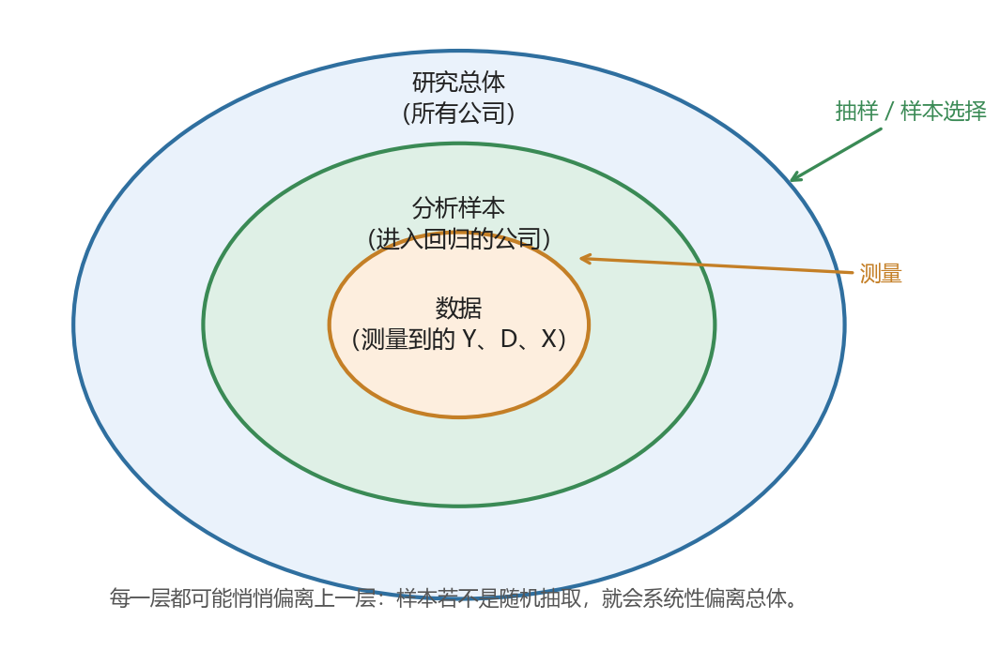
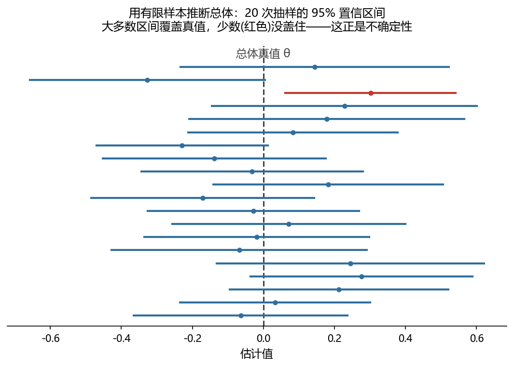
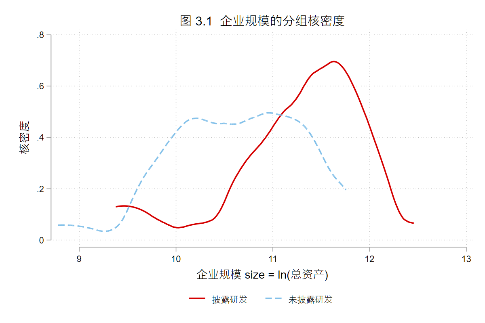

# 从总体到推断：实证分析的五层框架 {#sec-03}

::: {.callout-note title="本讲要点"}
- Population：研究总体、目标对象和外推边界；
- Sample：样本产生机制、抽样误差和样本选择偏误；
- Data：变量测量、代理变量、测量误差和数据质量；
- Model：模型设定、函数形式和误设风险；
- Inference：标准误、置信区间、显著性和不确定性表达；
- 随机抽样与随机分配的区别；
- 样本选择偏误与自选择偏误的基本直觉；
- 如何利用分组统计量、密度函数图、样本筛选表和政策背景说明，检查研究总体、分析样本、变量测量和模型设定是否相互匹配。
- 本讲用到的 skills：[`core/02-paper-strategy`](../appendix/B_skills_index.qmd)；
- 可运行伴生文件：`examples/ch03/ch03_main.do`(Stata；配套一份公司-年度面板数据随本讲一起提供，只做诊断、不做清洗)。
:::

<!-- 状态 (W1)：第一批初稿 = 案例情境 + 概念讲解 (链条总览 + Population + Sample)，定文风送审。Data / 变量口径 / Model / Inference / 收口 + 从概念到工具 + 代码实操 + AI 协作 为后续批次。 -->

## 案例情境：同一个回归，为什么算出来的不是同一回事

先看一个几乎每位做实证研究的人都会遇到的情形。

我们想回答一个朴素的问题：研发投入更高的企业，是不是成长更快、绩效更好？手上有一份公司-年度面板数据，跑一个回归，系数为正且显著。看起来结论很清楚：研发有用。

但先不急于下结论，先看看这份数据是怎么来的。**只有那些主动披露了研发支出的公司，才进得了这份样本。** 而在现实里，愿意把研发支出写进报表的公司，往往本就是研发密集、规模较大、经营较规范的那一批；大量不披露研发的公司，被排除在样本之外。

于是同一个回归，结果就可能有不止一种解释：它估计的，究竟是研发本身的作用，还是「本来就较强的公司，恰好也披露研发」这一事实？若是后者，那个显著为正的系数，可能大半来自样本的构成，而非研发的效果。要在这两种解释之间做出取舍，需要额外的条件和判断，这也正是识别策略要处理的问题。

这就是本讲要处理的核心问题。你手上的样本、数据和变量，很少恰好等于你心里想研究的那个对象；**从「你想研究谁」到「你最后拿什么去跑回归」，中间隔着好几道传递，每一道都可能悄悄走样。** 看不见这些走样，就会把样本自身的特征，误当作总体的规律。

## 概念讲解：一条会走样的链条

把上面的问题一般化，一项实证研究其实是沿着这样一条链条展开的：

::: {.psdmi-box}
::: {.psdmi-title}
实证分析的五层框架
:::
::: {.psdmi-steps}
[**Population**<br>总体]{.node} <span class="arrow">→</span> [**Sample**<br>样本]{.node} <span class="arrow">→</span> [**Data**<br>数据]{.node} <span class="arrow">→</span> [**Model**<br>模型]{.node} <span class="arrow">→</span> [**Inference**<br>推断]{.node}
:::
一个实证研究是否可信，不只取决于模型是否复杂，还取决于总体、样本、数据、模型和推断之间是否一致。
:::

大纲把它概括为五层：总体 (Population)、样本 (Sample)、数据 (Data)、模型 (Model)、推断 (Inference)。但比「五个层次」更要紧的，是它们之间的那几个箭头：每个箭头都是一次传递，而**每一次传递，口径都可能发生漂移**——

- 从「总体」到「样本」：谁进了样本、谁没进，可能并不是随机的 (本讲开头那个披露问题，就出在这里)；
- 从「样本」到「数据」：你真正想量的东西 (比如「创新能力」)，未必量得准，手上的变量往往只是它的一个替身；
- 从「数据」到「你定义的变量」：同一个概念，换一种口径去构造结果变量 $Y$、处理变量 $D$、控制变量 $X$，结论可能就不一样；
- 到「模型」：模型的设定要和前面几层对得上，否则就是「误设」；
- 到「推断」：因为样本是抽出来的、本身会变，任何结论都带着不确定性，需要如实表达。



一项研究可不可信，往往不取决于模型有多复杂，而取决于**这条链有没有在某一环悄悄断掉**。下面我们一环一环地走。走的过程中你会慢慢体会到两件事：其一，结果不理想，多半坏在这条链的某一环，而不是回归命令写错了；其二，这条链也是理解因果推断、识别策略和内生性的那张地图——所谓内生性，多数时候就是这条链在某一处断了。理解它，是对自己整个分析过程多一分审慎的开始。

### Population：你到底想对谁说话

一切的起点，是先想清楚「研究总体」：这项研究的结论，究竟想说给谁听？

研究总体不是一个抽象的大词，它由你的研究问题界定。问「A 股上市公司的研发是否提升绩效」，总体就是所有 A 股上市公司；问「中国所有企业」，总体就把大量未上市、无报表的中小企业也算进来——这是两个差别很大的总体。**定义总体，本质上是在划一条边界：谁在里面，谁在外面。**

这条边界还有一个常被忽略的名字：「外推边界」。你在某个总体上得到的结论，只能稳妥地推广到这个总体之内。用上市公司样本估出的「研发回报」，未必适用于小微企业；用某个试点城市得到的政策效果，未必能推广到全国。**总体的隐含条件到哪里，你的结论就到哪里为止。** 一篇严谨的实证研究，会在一开始就把这条边界交代清楚，而不是把局部结论表述成普遍规律。

### Sample：谁进了样本，谁被挡在门外

有了总体，下一步是从中得到「样本」。这一环最容易出问题，因为「样本怎么产生」常被当作理所当然，其实里面藏着两类性质完全不同的偏差。

**先分清两种偏离：抽样误差与样本选择偏误。** 打个比方：总体是一整口鱼塘，样本是你捞上来的那一网鱼，你想用这一网的平均体重，去估整塘鱼的平均体重。

- 如果在全塘「随机撒网」，那么每一网的平均体重都会围绕真实值上下波动——这次偏大、下次偏小，样本量越大，波动越小。这种波动叫「抽样误差」，它是随机的，不会系统性地偏向某一方，增加样本量即可缓解。
- 如果只在「岸边浅水」捞 (那里恰好多是小鱼)，那么无论捞多少网、样本多大，估出的平均体重都会系统性地偏小。这种偏差叫「样本选择偏误」，它是系统的，样本量再大也无法消除——你只会把一个有偏的估计算得越来越精确。

一句话记住区别：**抽样误差是随机波动，样本选择偏误是系统偏向。** 前者靠更大的样本就能缓解，后者靠更大的样本只会把一个有偏的结论估得更精确，反而让人更确信。本讲开头的研发披露问题，正属于「只在岸边捞」——只看得见愿意披露的公司。

用记号把这层区别固定下来：设总体真值为 $\theta$、某次抽样得到的估计为 $\hat\theta$。随机抽样下，$\hat\theta$ 会围绕 $\theta$ 上下波动、平均而言不偏，即 $E[\hat\theta]=\theta$；而在有选择的样本里，$\hat\theta$ 的平均本身就偏离真值，即 $E[\hat\theta]\neq\theta$。样本量能缩小前一种波动，却消不掉后一种偏离。

**再分清两个「随机」：随机抽样与随机分配。** 二者都带「随机」二字，管的却是两件不同的事。

- 「随机抽样」，是从总体中随机地抽取样本。它决定的是**样本像不像总体**——随机抽样的样本不存在选择偏误，可以稳妥外推；非随机抽样 (比如只抽披露公司) 则未必。
- 「随机分配」，是在样本内部随机决定谁接受处理、谁作对照 (典型如 A/B 测试：随机把用户分为看到促销和未看到促销两组)。它决定的是**处理组与对照组可不可比**——这是能否识别因果效应的关键。

二者相互独立，不宜混为一谈：你可能有一份随机抽样的样本，但企业是否上马某项目由其自己决定 (处理非随机，难谈因果)；也可能在一个代表性欠佳的样本里，做一场干净的随机分配实验 (内部可比，但外推需谨慎)。**一个管外推，一个管因果**，是两道各自要过的关。

**最后，落到样本选择偏误的内核：谁进入样本、谁的结果被我们观察到，究竟由什么决定？**

劳动经济学中一个经典的例子是女性工资。我们想研究教育对女性工资的影响，但数据里只有在工作的女性才有工资——没有工作的女性，其工资根本不存在于数据中。而是否工作并非随机：保留工资较高、不工作机会成本较大的人，更可能选择不工作。于是「在工作女性」这个样本，与「所有适龄女性」这个总体，在一些不可观测的因素上系统性地不同。你在这个样本上估出的教育回报，已经掺入了「谁会去工作」的信息。

下面这张模拟图直观地展示了这种偏差：当我们按结果变量去筛选样本时，OLS 拟合线会明显偏离全样本给出的结果 (这里先作简要示意，课堂上再展开)。


把「谁进入样本」写成一条规则会更清楚：设 $S_i=1$ 表示第 $i$ 个对象进入样本，它由某个规则决定，$S_i = f(\text{一些因素})$。这条规则就是「选择函数」。样本选择偏误的根源在于：**选择函数中的因素，恰好与我们关心的结果变量相关。** 是否披露研发 (选择) 与企业本身强弱 (结果) 相关，是否工作 (选择) 与潜在工资 (结果) 相关，都是如此。

顺带厘清一对常被混用的概念——「样本选择偏误」与「自选择偏误」：

- 若是外部规则把一部分对象挡在数据之外，我们只观察到其中一部分 (只观察到上市公司、只观察到就业者、只观察到披露研发的公司)，偏差出在「谁被观察到」，这是狭义的「样本选择」；
- 若结果在所有对象身上都可观察，只是对象自己选择要不要接受某种处理 (企业自行决定是否申请某项补贴)，偏差出在「谁去接受处理」，这是「自选择」。

二者都会让简单比较失真，但失真的位置不同、对策也不同。这条分界线在因果推断中会反复出现，值得早些建立直觉。

::: {.callout-note title="选择函数点到为止，校正方法不展开"}
这里我们只需建立一个直觉：**样本并非凭空而来，它由一条选择函数产生；一旦这条函数与结果相关，简单比较就会有偏。** 至于如何用模型刻画并校正这种选择 (如 Heckman 的思路)，属于进阶内容，本讲不展开。有兴趣的读者，可参阅连享会《因果推断》讲义中[讨论样本选择偏误的一章](https://lianxhcn.github.io/ci-policy/lectures/03_sample_selection.html)；更系统的估计方法，则留待高级班。
:::

### Data：你量到的，是不是你想量的

样本确定了「观察谁」，但我们最终能分析的，不是对象本身，而是对象在数据里留下的测量值。从「样本」到「数据」这一步，问的是另一个问题：你量到的东西，是不是你真正想量的东西？

很多我们真正关心的概念，本身无法直接观测。「创新能力」「公司治理水平」「企业风险」都是如此。研究中只能退而求其次，用一个可观测的变量去代替它，这个替身就叫「代理变量」。用研发支出代理创新能力、用董事会独立性代理治理水平、用股价波动代理风险，都是常见做法。代理变量用起来方便，但要始终记得：**它和它想代表的那个概念之间，总隔着一段距离。** 研发支出高，未必等于创新能力强，它还掺着企业规模、行业属性、会计口径等许多其他因素。

即便是可以直接测量的变量，也难免带着「测量误差」：记真值为 $x^*$、观测值为 $x$，二者往往并不完全相等，$x = x^* + e$。测量误差落在不同变量上，后果并不一样。落在被解释变量上，多数时候只是放大噪声、降低估计精度；落在核心解释变量上，则可能把系数系统性地拉向零——你明明测到了一个真实存在的关系，却因为变量量得不准，把它的强度低估了。这一点，是许多「效应比预期弱」的结果背后，常被忽略的原因。

数据质量则是这一环的底座：测量口径是否前后一致、有没有系统性的缺失或录入错误，直接决定后面所有分析是否站得住。**数据不干净，再精巧的模型也只是把脏数据算得更精确。**

### 变量口径：$Y$、$D$、$X$ 都是你亲手定义的

有了数据，还要把它组织成模型能用的变量：结果变量 $Y$、处理变量 $D$、控制变量 $X$。这一步常被当成纯技术操作，其实处处是判断——**同一个概念，换一种口径去构造，结论可能就不一样。**

先看结果变量 $Y$。想衡量「企业绩效」，用 ROA、ROE 还是 Tobin's Q？三者口径不同、侧重不同，同一份数据、同一个自变量，换一个 $Y$ 跑出来的结论完全可能不一致。选哪一个，取决于你的研究问题问的是哪一种绩效，而不是哪个变量跑出来更显著。

再看处理变量 $D$，也就是「谁算受了影响」。这一步的口径尤其容易和前面的总体、样本对不上。以一项环保督察为例：把处理组定义为「被督察省份的所有企业」，还是「被督察地区里的高污染企业」，是两个差别很大的 $D$。前者把大量本就与政策无关的企业也算作处理组，会把真实效应稀释掉。政策作用在哪一层，$D$ 就该定义在哪一层，否则模型比较的根本不是政策本身。

最后是控制变量 $X$。控制变量并非越多越好。如果你控制了一个本身也受处理变量影响的变量 (它其实是结果的一部分)，就会把真实效应挡掉一截——这类变量被称为「坏控制」。该控制什么、不该控制什么，取决于你对这些变量之间关系的判断，而不是把手边所有变量不加甄别地放进回归。

一句话：**$Y$、$D$、$X$ 的口径都是研究者定的，定的时候就要回头对齐总体与样本——口径一变，整条链的含义都会跟着变。**

### Model：模型要和前面几层对得上

到这里才轮到「模型」。不少人以为实证的核心是选模型，其实模型是被前面几层逼出来的：它要和你的总体、样本、变量口径都对得上。

模型设定里，最基本的是「函数形式」。可以把模型写成 $Y = f(X) + \varepsilon$：所谓设定模型，就是选定这个 $f$ 的形状——变量之间是线性关系，还是取对数后才近似线性，或者本身是非线性的？$f$ 选错了，就是「误设」。一个本该取对数的右偏变量，若硬按原始尺度进入回归，估出的系数既难解释，也可能有偏。

更隐蔽的误设，来自层级不匹配。还是上面那个督察的例子：政策实际作用在省级，你却用企业级数据、把处理和比较都放在企业层面，模型比较的对象就未必对应政策真正影响的层级。**模型误设的本质，是模型描述的世界，和数据实际生成的方式对不上。** 这也正是内生性的重要来源之一。

### Inference：因为样本会变，结论带着不确定性

走到最后一环。假设前面四层都对齐了，模型也估出了一个系数，我们还差一个问题：这个数字有多可靠？

可靠性问题的根子，还在「样本」那一环——样本是从总体里抽出来的，换一批样本，估计值就会变。**正因为估计值会随样本波动，任何结论都带着不确定性，而推断，就是把这份不确定性如实表达出来。**

- 「标准误」度量的就是这种波动：如果反复抽样、反复估计，系数大致会在多大范围内起伏。
- 「置信区间」把它写成一个区间，告诉你估计值大致落在哪一段，而不是假装它是一个精确的点。
- 「显著性」回答的是：观察到的这个关系，有多大可能只是抽样波动造成的假象。

写成记号，一个系数的 95% 置信区间大致是 $\hat\beta \pm 1.96\,\widehat{se}(\hat\beta)$：以估计值为中心，向两侧各留出约两个标准误的余地。它的含义常被误解——并非「真值有 95% 的概率落在这个区间里」，而是：若反复抽样、反复构造这样的区间，长期看约有 95% 的区间会盖住真值。下图用一个模拟把这层意思画了出来。



这里要守住一条底线：**显著，不等于证据充分；不显著，也不等于没有效应。** 显著性高度依赖样本量——样本足够大，再微弱的关系也会显著；样本很小，真实的效应也可能测不出显著。把「p 值小」直接当成「结论成立」，是实证中最常见的误读之一。至于标准误具体怎么算 (异方差、聚类等)，属于回归分析的细节，这里只需先记住它表达的是什么。

### 这条链，正是因果推断的地基

回头看这五层，会发现一件事：**实证研究里那些让人头疼的问题，几乎都是这条链在某一处断了。**

- 样本选择偏误，是「总体 → 样本」断了；
- 测量误差、代理变量失真，是「样本 → 数据」断了；
- 变量口径不当、坏控制、遗漏变量，是「数据 → 变量 → 模型」断了；
- 模型误设，是「模型」这一环与数据生成方式对不上。

这些断裂，在因果推断里有一个统一的名字：「内生性」。所谓识别策略，说到底就是想办法让某一处断掉的比较重新变干净——借助随机分配、找一个外生的变动，或构造一个可信的对照。这些方法本身怎么做，是高级班的内容 (可先浏览[连享会关于现代因果推断方法的整理](https://www.lianxh.cn/details/1811.html))；但它们要解决的问题，全都藏在这条链里。

所以，把这条链看懂，不只是为了这一讲。它真正的价值在于：当你自己的实证结果不理想时，能顺着这条链一环一环去找问题出在哪，而不是盲目地换命令、加控制变量。也正因为看清了每一环都可能出错，你才会对自己的每一个分析步骤，多一分应有的审慎。

## 从概念到工具

链条讲通了，接下来把「怎么检查链条有没有断」落成几件具体、可上手的动作。它们不是新方法，而是从前面的概念里自然长出来的检查手段——每一件，都对准链条上最容易断的一处。

### 分组统计量：两组到底可不可比

回到本讲开头的问题：披露研发的公司和不披露的公司，可能本来就不是一类企业。要判断两组能不能直接比较，最朴素的办法，就是**把两组的关键特征并排摆出来看**。

按组计算均值、中位数、标准差，再逐个变量对比：处理组和对照组在规模、盈利、行业分布上差多少？如果两组在这些特征上就已经差得很远，那么「处理后的差异」很可能掺着「两组本来就不同」的成分，而未必是处理本身的作用。**分组统计量，是检查可比性的第一道体检。** 差距越大，越要回头追问选择机制与变量口径。

### 假设检验：组间差异，是信号还是抽样波动

分组统计量告诉我们两组均值不一样，但先别急着下结论——样本是从总体里抽出来的，本身就带着抽样误差，两组的差异有可能只是这一次抽样碰巧造成的。于是问题变成：**眼前这个差异，是真实存在的信号，还是抽样波动的假象？**

这正是「假设检验」要回答的。它的直觉很朴素：先假设两组其实没有差别，再问——如果真是这样，仅凭抽样波动，能不能碰巧出现眼前这么大的差异？如果这种巧合几乎不可能发生 (也就是 p 值很小)，我们才有理由说，差异不是运气，而是真的。两组均值差的 $t$ 检验，做的就是这件事。

可以看到，Inference 那一层讲的标准误、p 值、置信区间，到这里第一次派上了用场——**它们不是报告时才用的摆设，而是从「样本会变」这件事里长出来的判断工具。** 同时也别忘了那条底线：样本很大时再小的差异都会显著，所以既要看 p 值，也要看差异本身有多大、有没有实际意义。

### 密度函数图：两组是不是一套形状

均值一样，不代表两组长得一样。两组可能均值接近，分布形态却大不相同：一组集中、一组分散，或者某一组在某个区间整片缺失。这些，光看几个统计量是看不出来的。

把两组的核密度曲线叠在一张图上，一眼就能看出：分布是否错开、有没有离群的长尾、有没有明显的断点，以及**有没有样本选择的痕迹——比如某一组的低值区整片为空，说明这部分对象根本没进样本**。密度图比分组统计量更细：统计量是几个数，密度图是整条分布。

这里真正要记住的，**不是画图命令，而是一种意识**：拿到一个连续变量，先想想它的分布长什么样、在不同子样本里差在哪。至于怎么画，Stata 和 Python 都很容易实现，也不必背专门的命令——实践中更好的做法，是把绘图直接交给 AI：说清要比较哪个变量、按什么分组，让它生成代码即可 (本讲代码实操会给出这样一段提示词)。

### 样本筛选表：口径怎么一步步筛出来的

从最初拿到的数据，到最终跑回归的分析样本，中间往往删掉了不少观测：剔除金融行业、剔除数据缺失、剔除异常值……每一步都在改变「样本是谁」。**样本筛选表，就是把这个过程一行一行记下来**：每一步剔除了什么、还剩多少观测、多少家公司。

它有两个作用。一是透明可复核：别人 (包括半年后的你自己) 能照着复现出同一份样本。二是对样本选择保持警觉：如果某一步一下子筛掉了大量某类对象，就要当心——最终样本会不会已经系统性地偏离了总体？

### 政策背景说明：制度事实是判断的锚

前面几件工具都在数据里做检查，但有些判断，数据本身给不出答案，得回到制度事实里找。处理组和对照组的划分合不合理、政策究竟在什么时点、作用在哪一层，这些都要靠**把政策背景讲清楚**来支撑。

一份好的政策背景说明，会交代：政策的官方名称与时间、直接作用的对象 (地区、行业还是企业)、处理组能否在数据里识别、以及最容易被质疑的地方。它是前面所有检查的锚点——**脱离制度事实去谈样本和变量，很容易把技术上的巧合，误当成经济上的因果。**

### 合起来：给整条链做一次一致性体检

这几件工具合在一起，就是对整条链做一次「一致性体检」：用分组统计量和假设检验查两组可不可比，用密度图查分布是否一致，用样本筛选表查样本是怎么来的，再用政策背景说明把这些判断锚在制度事实上。**体检的目标只有一个：看总体、样本、数据、变量和模型是不是互相对得上。** 下一节，我们就在一份公司-年度面板上，把这套体检动作实际走一遍。

## 代码实操

把前面讲的检查工具，在一份结构真实的面板上依次跑一遍。数据随本讲提供 (`examples/ch03/`，模拟生成、可复现)，只做诊断、不做清洗；下面的代码与输出，都可在配套的 `ch03_main.do` 中复跑。

这份面板是 42 家上市公司 × 2020–2022 三年 = 126 个公司-年度观测，涵盖电子、医药、汽车三个行业。我们想研究「研发投入是否提升企业绩效」，但只有披露了研发支出的公司，`rd` 才可见——不披露的公司，进不了「研发—绩效」的分析样本。变量 `disclose` 标记是否披露，`size` 是 ln(总资产)，`roa` 是资产收益率。下面就来看：进入分析样本的披露组，和被挡在外面的未披露组，到底可不可比。

### 分组统计量：两组可比吗

先把两组的关键特征并排摆出来。

```stata
* 数据可联网直读(无需下载)；也可克隆仓库后把 $D 改成本地路径
global D "https://raw.githubusercontent.com/lianxhcn/PXa2026a/main/examples/ch03/data"
use "$D/firm_year.dta", clear
tabstat size roa sales lev, by(disclose) stat(mean sd) nototal
```

```text
disclose |      size       roa     sales       lev
---------+----------------------------------------
  未披露 |  10.61037  .0416825  41349.62   .476616
         |  .6921522  .0284131  24650.36   .071487
---------+----------------------------------------
    披露 |  11.23799  .0626257  80705.29  .4959391
         |  .7374012  .0331485  42275.03  .0636639
--------------------------------------------------
```

披露组的规模 (`size` 11.24 对 10.61)、盈利 (`roa` 6.3% 对 4.2%) 和营收 (`sales` 8.1 万对 4.1 万) 都系统性地高于未披露组，只有资产负债率 (`lev`) 两组接近。也就是说，**进入分析样本的公司，本来就比落选的更大、更赚钱**。这意味着「研发与绩效正相关」这个结论，可能有相当一部分来自「大公司既愿意披露研发，本身绩效也好」，而非研发的作用。

### 假设检验：差异是信号还是抽样波动

两组均值不一样，但样本是抽出来的，会不会只是抽样波动？用 `ttable2` 一次检验多个变量的组间差异。

```stata
ssc install ttable2, replace     // 首次运行需先安装
ttable2 size roa sales lev, by(disclose)
```

```text
--------------------------------------------------------------------------
Variables   G1(未披露)       Mean1     G2(披露)       Mean2      MeanDiff
--------------------------------------------------------------------------
size          63             10.610       63          11.238     -0.628***
roa           63              0.042       63           0.063     -0.021***
sales         63            4.1e+04       63         8.1e+04   -3.9e+04***
lev           63              0.477       63           0.496     -0.019
--------------------------------------------------------------------------
```

`size`、`roa`、`sales` 的组间差异都在 1% 水平上显著 (`***`)，不是抽样波动，而是系统性差异。值得注意的是 `lev` 的差异 (-0.019) 并不显著：两组的不同并非无处不在，而是**集中在与「大小、强弱」相关的维度上**——恰恰是最可能干扰「研发—绩效」判断的那些维度。再提醒一次那条底线：这里的显著只说明差异真实存在，并不说明研发有效；恰恰相反，它是在告诉你，两组本就不是一类公司。

### 密度函数图：分布对不对得上

均值和检验给的是几个数，密度图能让我们看到整条分布。把两组的 `size` 核密度叠在一起：

```stata
twoway (kdensity size if disclose==1) (kdensity size if disclose==0)
```



披露组 (实线) 整体明显右移、集中在规模较大处；未披露组 (虚线) 偏向规模较小处；而在低规模区，披露组几乎为空。**这正是样本选择的痕迹：规模小的公司很少进入分析样本。** 均值只告诉你两组中心不同，密度图进一步告诉你，它们连形状和覆盖范围都不一样。

::: {.callout-note title="提示词：把画图交给 AI"}
> 我有一份公司-年度面板 (变量：企业规模 `size`、是否披露研发 `disclose`)。请生成 Stata 代码，画一张「按 `disclose` 分组的 `size` 核密度叠加图」，两组用不同线型，并加中文图例与坐标轴标题。若你更熟悉 Python，也可以用 seaborn 或 matplotlib 给出等价实现。
:::

这里真正要练的，不是记住 `kdensity` 的写法，而是**养成「按子样本比较分布」的意识**；具体代码，说清需求后交给 AI 即可。

### 样本筛选表：分析样本是怎么来的

最后，把「样本怎么筛出来」记成一张表。

```stata
count                     // 初始：所有公司-年度
count if !missing(rd)     // 分析样本：披露研发、rd 可得
```

```text
步骤                             剔除观测    剩余观测  公司
----------------------------------------------------------
初始(所有公司-年度)                —            126      42
剔除未披露研发(rd 不可得)              63        63      21
----------------------------------------------------------
```

126 个公司-年度里，有 63 个 (21 家公司) 因未披露研发而落选，最终分析样本只剩 63 个 (21 家)。而落选的这一半，正是前面看到的规模较小的那批。于是**分析样本系统性地偏向又大又强的公司，它已经不是「所有公司」的代表了**。

### 鱼塘抽样模拟：抽样误差与选择偏误的区别

最后用一个小模拟，把「抽样误差」和「选择偏误」的区别看得更透。把全体 126 家的 `size` 当作一整口鱼塘 (真实平均 = 10.924)，比较两种捞法，各重复 500 次 (完整代码见 `ch03_main.do`)。

```stata
* (a) 随机撒网：每次从全体随机抽 30 个，算平均规模
* (b) 只在披露组捞：每次只从披露组抽 30 个，算平均规模
* 各重复 500 次，看 500 个平均值的分布
```

```text
随机撒网(500 次)：      均值的均值 = 10.927    标准差 = .118
只在披露组捞(500 次)：  均值的均值 = 11.238    标准差 = .100
```

随机撒网 500 次，平均值紧紧围绕真实值 10.924——这是**抽样误差**，随机、无偏，样本量越大波动越小。只在披露组捞，平均值稳定在 11.238，系统性地高出一大截——这是**选择偏误**。特别要注意：它的标准差 (0.100) 甚至更小。换句话说，你会把一个偏高的数估得又稳又「精确」，却始终偏离真相；样本量再大，也救不了。

把四步连起来，指向同一个结论：这份「研发—绩效」研究的分析样本，系统性地偏向又大又强的公司。若不加甄别地在这个样本上估研发的作用，很可能把「本来就强」误当成「研发有效」。这，正是本讲开头那个问题的答案——同一个回归，因为样本是谁不同，含义就不同。

## AI 协作

::: {.callout-important title="契约边界"}
本节逐条覆盖大纲「AI 协作训练」四项，不删项、不缩范围。每项给一份可复制的提示词、标注对应的 core skill，并说明怎么人工核对。这些任务，网页版 AI 助手大多都能完成。
:::

这四项训练，本质上都是让 AI 陪你把前面那条链再走一遍：「顺着拆」——把一篇论文拆成五层；「反着查」——看五层之间有没有对不上。它们共用同一个 skill：[`core/02-paper-strategy`](../appendix/B_skills_index.qmd)。

### 训练 1：让 AI 把一篇论文拆成五层

**任务**：把论文交给 AI，让它按总体、样本、数据、模型、推断五层拆解，产出一张五层拆解卡。

::: {.callout-note title="提示词"}
> 这是一篇实证论文 (附 PDF)。请面向计量基础较弱的读者，把它按「五层框架」拆成一张中文卡片，每层一小段：
>
> - 总体 (Population)：研究对象是谁？结论的外推边界在哪？
> - 样本 (Sample)：样本怎么产生的？有没有可能的样本选择？
> - 数据 (Data)：关键变量怎么测量的？有没有用代理变量？
> - 模型 (Model)：用了什么模型设定和函数形式？
> - 推断 (Inference)：怎么表达不确定性 (标准误、置信区间、显著性)？
>
> 只依据论文本身，不要编造；每条结论尽量标出对应的图表或页码；不确定的地方标出来，让我核对。
:::

**对应 skill**：`core/02-paper-strategy`。**人工核对**：对照原文摘要与关键图表，抽查每层结论；特别留意 AI 会不会把「样本选择」凭空安到一篇其实没有这个问题的论文上。

### 训练 2：把 AI 设成 coauthor，逐层追问一致性

**任务**：让 AI 扮演一位严格的合作者或论文导师，从五层逐一追问这项研究站不站得住。

::: {.callout-note title="提示词"}
> 请你扮演一位严格但善意的合作者，针对这篇研究 (附)，从下面五个层次逐一追问，每层给出你的疑问和判断依据：
>
> - 研究对象是否清楚？结论想推广到的总体是什么？
> - 样本是否可能存在选择偏误？谁被排除在样本之外？
> - 关键变量是否测量准确？有没有测量误差或代理变量失真？
> - 模型设定是否匹配研究问题？有没有明显的误设或坏控制？
> - 推断是否支撑论文的结论？显著性有没有被过度解读？
>
> 每条追问都要给出依据，并指出作者可以怎么回应或补强。不确定的地方如实说明。
:::

**对应 skill**：`core/02-paper-strategy`。**人工核对**：AI 的追问是灵感来源，不是定论；哪些疑问真的成立、哪些是它想多了，要你回原文判断。

### 训练 3：生成一份「样本与研究设计一致性检查清单」

**任务**：把分组统计量、密度图、样本筛选表和政策背景材料交给 AI，让它据此产出一份可勾选的一致性检查清单。

::: {.callout-note title="提示词"}
> 我在检查一篇研究 (或我自己的研究) 里，样本和研究设计是否互相匹配。以下是我手头的材料 (可附其中若干)：分组统计量表、分组密度图、样本筛选表、政策背景说明。请据此帮我生成一份可勾选的「样本与研究设计一致性检查清单」，覆盖：总体与样本是否一致、处理组与对照组是否可比、关键变量口径是否清楚、样本筛选是否可能造成选择偏误、模型层级是否对应政策作用层级。每一条写成一个可回答「是 / 否 / 存疑」的检查项，并说明该怎么用我给的材料去判断。
:::

**对应 skill**：`core/02-paper-strategy`。**人工核对**：清单是脚手架，每一项的「是 / 否」得由你拿着材料亲自判定，AI 不替你下结论。

### 训练 4：让 AI 找出四者之间的明显不一致

**任务**：把研究问题、样本口径、变量构造、模型设定四份说明交给 AI，让它交叉比对、标出冲突。

::: {.callout-note title="提示词"}
> 下面是一篇研究的四份说明 (附)：(1) 研究问题；(2) 样本口径与筛选规则；(3) 核心变量的构造方式；(4) 模型设定。请你交叉比对这四者，找出明显不一致或对不上的地方，例如：研究问题针对的总体和实际样本口径不符、处理变量的层级和模型层级不一致、控制变量里混进了坏控制等。逐条列出你发现的冲突、它可能带来的问题，以及建议怎么核实。只依据我给的材料，不要脑补我没写的内容。
:::

**对应 skill**：`core/02-paper-strategy`。**人工核对**：AI 找出的「不一致」有真有假；把它当成一份待核清单，逐条回到材料和数据去确认。

## 小结与练习

本讲把实证研究还原成一条会走样的链条：从你想研究的总体，到实际拿到的样本，到测量出的数据，再到你亲手定义的 $Y$、$D$、$X$，最后落到模型与推断。每一次传递，口径都可能漂移；样本选择偏误、测量误差、变量口径不当、模型误设，都是这条链在某一处断了。随后，我们把「怎么查链条有没有断」落成了五件工具：分组统计量、假设检验、密度函数图、样本筛选表和政策背景说明，合起来就是一次一致性体检。

一句话带走：**这条链，既是诊断自己结果为什么不好的地图，也是进一步理解因果推断、识别策略和内生性的地基。**

### 练习

::: {.callout-note title="练习 1(概念·判断链条断在哪)"}
一位研究者想研究「中国所有制造业企业的融资约束」，但数据只覆盖 A 股上市的制造业公司。请指出这项研究最可能在链条的哪一环出问题、属于哪类偏误，并说明它会如何影响结论的外推。

::: {.callout-tip collapse="true" title="参考答案"}
问题出在「总体 → 样本」这一环。目标总体是所有制造业企业，实际样本只有上市公司——能上市本身就是一道强筛选 (规模较大、经营较规范、能过审)，属于样本选择。于是结论只能稳妥地外推到上市公司这个子总体；若当作「所有制造业企业」的规律，就越过了外推边界。而且上市公司的融资约束通常更低，把它的结论套到全体制造业上，会系统性地低估整体的融资约束程度。
:::
:::

::: {.callout-note title="练习 2(概念·变量口径)"}
两位研究者用同一份数据研究「研发对企业绩效的影响」，一位用 ROA 作结果变量，另一位用 Tobin's Q，结论方向相反。请解释这是链条哪一环的问题，以及该如何判断谁更合适。

::: {.callout-tip collapse="true" title="参考答案"}
问题出在「数据 → 变量」这一环，也就是变量口径。ROA 衡量的是当期会计盈利能力，Tobin's Q 更接近市场对企业未来价值的预期；研发短期会压低利润、却可能抬高长期价值预期，所以两个 Y 给出相反方向并不奇怪。谁更合适，取决于研究问题问的是哪一种「绩效」——短期盈利，还是长期价值，而不是哪个跑出来更显著。
:::
:::

::: {.callout-note title="练习 3(交给 agent 并审计)"}
任选一篇你自己研究领域的实证论文，用本讲「训练 1」的提示词让 AI 把它拆成五层；然后回到原文，找出 AI 的拆解里至少一处不准确或含糊的地方，并说明你是怎么发现的。

::: {.callout-tip collapse="true" title="参考答案 (要点)"}
本题没有标准答案，重点在「审计」这一步。合格的回答应能指出 AI 的具体错处 (例如把稳健性检验当成主模型、误判样本口径、给一篇本无样本选择问题的论文安上选择偏误、图表编号对不上)，并说明核对依据 (原文的数据与样本说明、方法部分、图表编号)。能稳定地发现并纠正 AI 的偏差，正是本讲要练的能力。
:::
:::

## 延伸阅读

- **样本选择偏误的深入**：连享会《因果推断》讲义中[讨论样本选择偏误的一章](https://lianxhcn.github.io/ci-policy/lectures/03_sample_selection.html)，以及配套的 [Heckman 选择模型扩展阅读](https://lianxhcn.github.io/ci-policy/lectures/appendix/A03_heckman_selection_literature.html)。选择模型的估计方法本身属进阶，留待高级班。
- **中国政策场景下的处理组定义与识别风险**：连享会整理的中国政策冲击案例库 (政策事实、处理组与对照组的划分、识别风险)，可作为「迁移到中国场景」的延伸材料。<!-- TODO(待核)：补 china-policy-shocks 已发布 URL -->
- **总体、样本与测量的入门讲法**：Wooldridge《计量经济学导论》第 1 章 (实证分析的步骤、数据结构、因果与反事实) 与第 9 章 (代理变量、测量误差、非随机样本与函数形式误设)，统一见[阅读清单](../appendix/D_reading_list.qmd)。
- **方法进阶 (现代因果推断与识别策略)**：留待高级班，可先浏览[连享会关于现代因果推断方法的整理](https://www.lianxh.cn/details/1811.html)。
