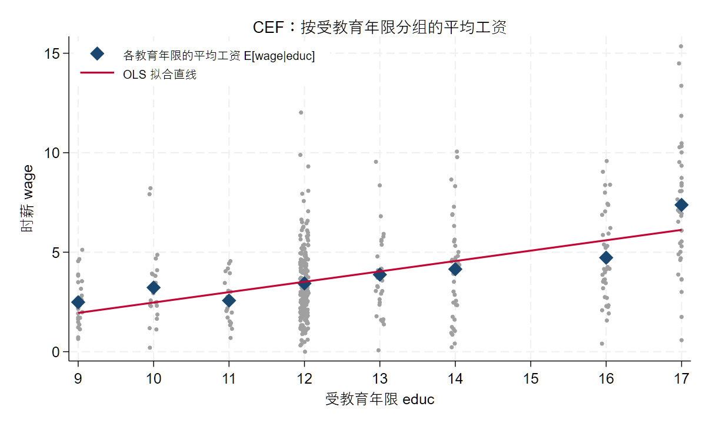
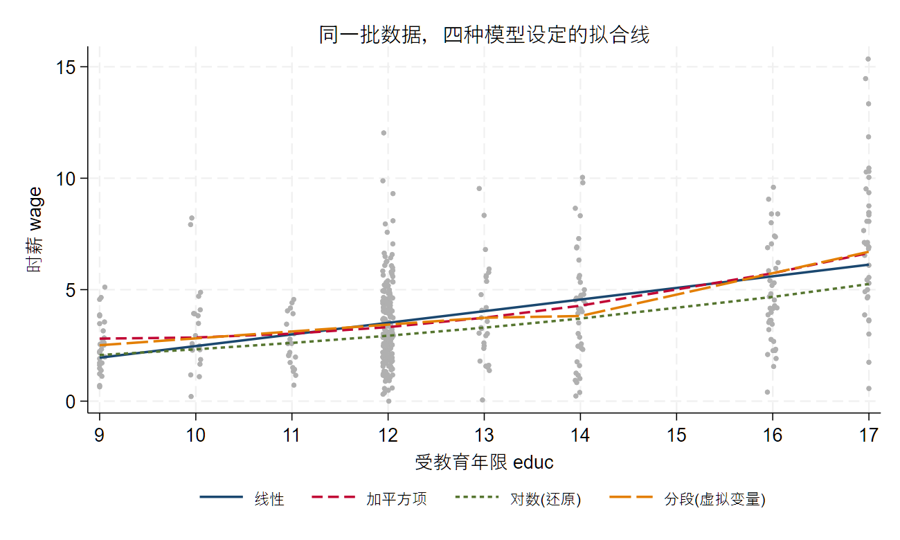
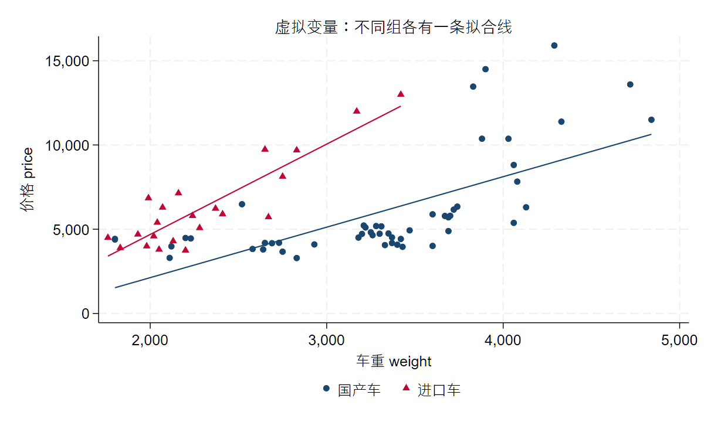
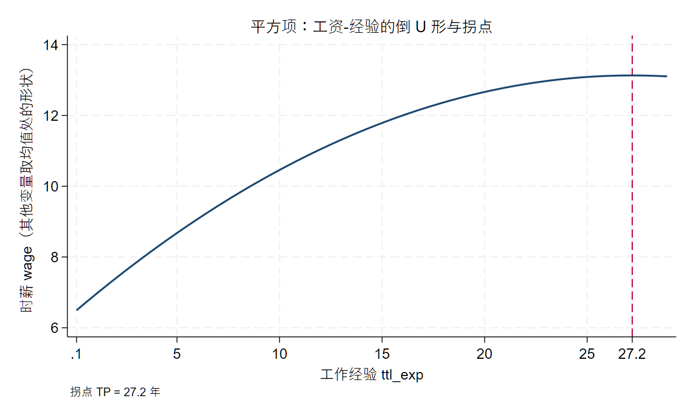

# 线性回归的建模语言：CEF、OLS 与统计推断 {#sec-04}

::: {.callout-note title="本讲要点"}
- 条件期望函数 (CEF) 与线性投影；
- OLS 系数的含义和局限；
- 回归系数不是简单的「影响」，而是在特定条件下形成的比较；
- 模型设定、函数形式和变量尺度；
- 对数模型、比例变量、标准化变量和系数解释；
- 交乘项与异质性：调节效应、边际效应与中心化 (承接大纲 A5，见「代码实操 · 交叉项」)；
- 断点回归 (RDD) 初步：用图形识别断点处的跳跃 (承接大纲 A5，见「代码实操 · 断点回归初步」)；
- 统计显著性、经济显著性和结果解释边界；
- 异方差稳健标准误与聚类稳健标准误；
- 如何阅读回归表中的系数、标准误、置信区间、显著性和样本量；
- 如何从回归表写出不过度解释的结果说明。
- 本讲用到的 skills：[`core/05-regression-interpreter`](../appendix/B_skills_index.qmd)；
- 可运行伴生文件：`examples/ch04/ch04_main.do`(Stata；配套 `mroz.dta` 等数据随本讲一起提供)。
:::

<!-- 状态 (W3)：案例情境 + 概念讲解 已按 A5.do 主线重写 (wage 水平值、CEF 三图、分组均值 aweight 演示、四种设定枢纽、公式列全)。代码实操、结果解释与因果护栏、AI 协作、小结与练习、延伸阅读 为后续批次。本讲不单独设 Python 附录 (改以 AI 协作里的提示词演示替代)。图形：自绘图存 images/ch04/；老师图床图直链；教材版权图暂不入公开正文，只标注可插入处。 -->

## 案例情境：一个系数，三种读法

先从一个几乎人人都跑过的回归说起。

手上是一份劳动经济学的经典数据 (`mroz`，421 位在业女性)，我们想看看教育和工资的关系，把时薪 `wage` 对受教育年限 `educ` 回归：

```stata
webuse mroz, clear
* 只保留在职女性(wage>0)，剔除个别极端高薪，并把人数过少的教育年限并组（详见下一节）
drop if wage==0
drop if wage>17
replace educ = 9  if educ<=9
replace educ = 14 if educ==15
reg wage educ
```

```{.stata code-line-numbers="false"}
------------------------------------------------------------------------------
        wage | Coefficient  Std. err.      t    P>|t|     [95% conf. interval]
-------------+----------------------------------------------------------------
        educ |      0.522      0.048    10.76   0.000        0.426       0.617
       _cons |     -2.744      0.624    -4.40   0.000       -3.971      -1.517
------------------------------------------------------------------------------
  N = 421     F(1, 419) = 115.85     R-squared = 0.217     Root MSE = 2.11
```

> 数据说明：`mroz` 是 Stata 自带的网络数据，用 `webuse mroz` 即可直接载入，无需下载。本讲用到的另外两份数据 (`xtcs`、`B1_production`) 随本仓库提供，用一个全局宏指到线上路径即可读取 (见「代码实操」开头)。

结果很干净：`educ` 的系数是 0.522，高度显著。写成方程就是

$$
\widehat{wage} = -2.74 + 0.52 \times educ
$$

它大致意味着「受教育年限每多一年，时薪高约 0.52 美元」。

问题来了：这个 0.52，到底该怎么读？至少有三种读法——

- **读法一 (因果)**：「让一个人多读一年书，她的时薪会上涨约 0.52 美元。」
- **读法二 (比较)**：「在这份样本里，受教育多一年的那一批人，时薪平均高约 0.52 美元。」
- **读法三 (预测)**：「知道一个人多读了一年书，我就把对她时薪的猜测调高约 0.52 美元。」

三种读法，数值一样，含义天差地别。读法一是**因果**断言，需要额外的识别假设才站得住；读法二只是**描述性比较**，是回归系数本本分分能给的东西；读法三则把回归当成一台**预测机器**。**回归命令算出的那个数，本身并不告诉你该用哪一种读法。** 把数值当成因果，是实证研究里最常见、也最隐蔽的过度解释。

这就是本讲要做的事：把「跑回归」变成「理解模型」。跑一个回归只要一行命令，但要说清楚那个系数是什么、能读到哪一步、不能读到哪一步，得先弄明白回归到底在估计什么。想清楚这件事，你写结果时才不会把「比较」误写成「影响」。

## 概念讲解：回归到底在估计什么

### 条件期望函数：按 X 分组求平均

抛开公式，先看回归在直觉上做了一件什么事。

还是教育和工资。为了把「分组平均」看清楚，我们先对数据做一点基础清理 (这也是上一段代码里那几行预处理在做的事)：只留在职女性、剔掉个别极端高薪、把人数太少的教育年限并到相邻组，剩下 421 位、8 个教育档位。然后按受教育年限分组，算出每一组的**平均时薪**：

```stata
webuse mroz, clear
drop if wage==0
drop if wage>17
replace educ = 9  if educ<=9
replace educ = 14 if educ==15
bysort educ: egen wage_m = mean(wage)   // 每个 educ 组的平均 wage
```

| 受教育年限 `educ` | 9 | 10 | 11 | 12 | 13 | 14 | 16 | 17 |
|:---|:--:|:--:|:--:|:--:|:--:|:--:|:--:|:--:|
| 平均时薪 `wage_m` | 2.5 | 3.2 | 2.6 | 3.4 | 3.9 | 4.1 | 4.7 | 7.4 |

这张表在说一件朴素的事：**给定受教育年限，这一组人的平均时薪是多少。** 读过 12 年书的人，平均时薪 3.4；读过 16 年的，4.7。把每一组的平均值画成一个点，就得到下面这张图里的深蓝菱形——**这些「在每个 X 上、Y 的平均值」的点，就是条件期望函数 (Conditional Expectation Function，CEF)**：

{#fig-cef width=90%}

CEF 用记号写出来特别简洁：

$$
\mathbb{E}[Y \mid X = x] = m(x)
$$

意思是「在 $X=x$ 这一组里，$Y$ 的平均值」，它是 $x$ 的一个函数 $m(x)$。放到我们的例子里，

$$
\mathbb{E}[wage \mid educ = 12] = m(12) = 3.4
$$

用 Stata 求某一组的 CEF，其实就是求一个条件均值——下面两条命令给出的常数项是一回事：

```stata
sum wage if educ==12   // 直接求 educ=12 这组的平均 wage
reg wage if educ==12   // 只含常数项的回归，截距 = 该组均值
```

CEF 是回归真正的估计目标。我们关心教育和工资的关系，本质上就是想知道：**从一个受教育水平挪到另一个，平均工资怎么变。** 这正是 CEF 描述的东西。

把观测值和 CEF 的关系写清楚，就得到建模的出发点。任何一个 $Y_i$，都可以拆成「它所在组的平均值」加「一个偏离」：

$$
Y = m(X) + e, \qquad \mathbb{E}[e \mid X] = 0, \qquad \mathbb{E}[e^{2} \mid X] = \sigma^{2}(X)
$$

- $\mathbb{E}[e \mid X]=0$ 是 CEF 的定义带来的：既然 $m(X)$ 是每组的平均，组内的偏离自然平均为零；
- $\mathbb{E}[e^{2}\mid X]=\sigma^{2}(X)$ 说的是每组内部的离散程度，它可以随 $X$ 变化——这一点后面讲**异方差**时会回来用到。

### 回归估计的就是 CEF

上面这条 CEF(8 个深蓝点) 和我们一开始跑的那条 OLS 直线 (红线) 到底什么关系？一个小实验能把它讲透。

我们分别跑三个回归：(1) 对全部 421 个**个体**回归；(2) 只对 8 个**分组平均值**回归；(3) 对 8 个分组平均值回归、但**按每组人数加权** (`aweight`)：

```stata
reg wage   educ                          // (1) 个体回归
reg wage_m educ                          // (2) 只用 8 个组均值
reg wage_m educ [aweight = Nj]           // (3) 组均值，按组容量 Nj 加权
```

```{.stata code-line-numbers="false"}
------------------------------------------------------------
                  (1)             (2)             (3)
           individual       groupmean    groupmean_aw
------------------------------------------------------------
educ            0.522***        0.497**         0.522**
              (0.048)         (0.102)         (0.103)
_cons          -2.744***       -2.361          -2.744
              (0.624)         (1.334)         (1.331)
------------------------------------------------------------
N                 421               8               8
------------------------------------------------------------
```

看第 (1) 列和第 (3) 列：斜率都是 **0.522**，截距都是 **−2.744**，一模一样。这不是巧合——**对个体做 OLS，等价于对各组的条件均值 (CEF 点) 做加权回归，权重就是每组的人数。** 换句话说，OLS 并没有去拟合那一大片散点，它真正在拟合的，是那 8 个 CEF 点。这就是「回归估计的是 CEF」这句话最直接的证据。

(第 (2) 列不加权，把人数悬殊的组一视同仁，斜率略有偏离——这也说明权重不是可有可无的。)

### 线性投影：给 CEF 选一条直线

CEF 未必是直的。看 @fig-cef：从 12 年到 13 年只涨了一点，从 16 年到 17 年却猛跳。如果每一段都单独估计，既费数据又难解释。于是我们退一步，**用一条直线去逼近这条 CEF**：

$$
\mathbb{E}[Y \mid X] \approx \alpha + \beta X
$$

这条「最能贴合 CEF 的直线」有个名字，叫**线性投影**。它不是假装 CEF 真的是直线，而是承认「我用一条直线来近似它」。怎么算出这条直线？OLS 的办法是让所有点到直线的**竖直距离平方和**最小，即最小化残差平方和 (Residual Sum of Squares, RSS)：

$$
\min_{\alpha,\ \beta}\ \ \text{RSS} = \sum_{i=1}^{N}\big(y_i - \alpha - \beta x_i\big)^2
$$

<!-- 此处可插入 RSS 几何示意 (老师图床 gr_OLS_sum_of_squares.png) 或自绘图；先留位 -->

求解出来，斜率有一个很直观的形式——它就是 $x$ 与 $y$ 的样本协方差除以 $x$ 的样本方差：

$$
\hat{\beta} = \frac{\sum_i (x_i - \bar{x})(y_i - \bar{y})}{\sum_i (x_i - \bar{x})^2}, \qquad \hat{\alpha} = \bar{y} - \hat{\beta}\,\bar{x}
$$

拿到 $\hat\alpha,\hat\beta$，每个观测的**拟合值**与**残差**分别是

$$
\hat{y}_i = \hat{\alpha} + \hat{\beta} x_i, \qquad \hat{e}_i = y_i - \hat{y}_i
$$

上面那个 0.52，就是用一条直线概括「教育每多一年、平均时薪大约高多少」的结果。公式服务于直觉：只要记住「回归 = 用直线概括 CEF」，就抓住了这一讲的地基。

### 换一个 f(·)，就是换一个模型

「用直线逼近 CEF」只是最简单的一种选择。CEF 本身是弯的，我们完全可以用别的函数形式 $f(\cdot)$ 去逼近它。事实上，本讲后面要讲的各种模型，都是在给同一条 CEF 选不同的 $f(\cdot)$：

$$
\begin{aligned}
&(1)\quad wage_i = \alpha + \beta\, educ_i + e_i && \text{(线性)}\\
&(2)\quad wage_i = \alpha + \beta_1 educ_i + \beta_2\, educ_i^{2} + e_i && \text{(平方项：允许弯曲)}\\
&(3)\quad \ln(wage_i) = \alpha + \beta\, educ_i + e_i && \text{(对数：改变尺度)}\\
&(4)\quad wage_i = \alpha + \beta\, educ_i + \gamma D_i + \theta\,(D_i\!\times\! educ_i) + e_i && \text{(虚拟变量 + 交叉项)}
\end{aligned}
$$

其中 (4) 里 $D_i=\mathbf{1}(educ_i>16)$ 是一个 0/1 变量。这四个模型形式不同，但**分析的都是同一样东西——条件期望 CEF**，只是对 $m(\cdot)$ 的形状做了不同假设。

把这四种设定的**拟合线**画在同一张散点图上，差别一目了然 (@fig-four)：线性是一条直线，平方项让它可以弯曲，对数 (换算回工资尺度后) 在高教育端更平缓，分段设定则在某个门槛处折一下。**同一批数据，选不同的 $f(\cdot)$，得到的拟合值就不一样**——这正是「模型设定」四个字最直观的样子。

```stata
* 四种设定各自的拟合值，叠在一张图上
reg wage educ
predict yhat_lin                       // (1) 线性
reg wage educ c.educ#c.educ
predict yhat_quad                      // (2) 平方项
reg lwage educ
predict lyhat
gen yhat_log = exp(lyhat)              // (3) 对数：换算回 wage 尺度
gen Dhi = (educ>13)
reg wage c.educ##i.Dhi
predict yhat_dum                       // (4) 分段（虚拟变量）
twoway (scatter wage educ, mcolor(gs11) msize(vsmall)) ///
       (line yhat_lin educ) (line yhat_quad educ) ///
       (line yhat_log educ) (line yhat_dum educ), sort
```

{#fig-four width=90%}

想清楚这一点，本讲后面「函数形式」「对数模型」「交叉项」「平方项」几节就不再是零散的技巧，而是同一个问题的不同侧面：**你打算用什么形状的 $f(\cdot)$，去描述 X 和 Y 的条件均值关系。**

::: {.callout-tip title="扩展：条件期望之外，还有条件分位数、条件概率"}
把「条件期望 $\mathbb{E}[Y\mid X]$」换成「条件中位数」或其它分位数，就得到分位数回归；换成「条件概率 $P(Y=1\mid X)$」，就得到 Logit / Probit 这类模型。**同一套「给定 X、看 Y 的某个特征」的思路，衍生出一大家子模型。** 本讲只走条件期望这一支，其余留待各自的专题。
:::

### OLS 是估计方法，不是模型

这里要澄清一个常见的糊涂账：**OLS 不是一个模型，而是一种估计方法。**

顺序是这样的。我们先有一个**假设**——X 和 Y 的条件期望呈线性关系：

$$
\mathbb{E}[Y \mid X] = \alpha + \beta X \tag{1}
$$

注意，(1) 式是假设，没法直接拿数据去估。结合前面 $Y = m(X)+e$，把 (1) 代进去，就得到常见的**回归模型**的设定：

$$
Y_i = \alpha + \beta X_i + e_i \tag{2}
$$

到这里还只是模型。怎么把其中的 $\alpha$、$\beta$ 估出来，有很多办法：

- **OLS**：假设 $x$ 与 $e$ 不相关，最小化残差平方和 $\sum e_i^2$；
- **MLE**：假设 $e$ 服从正态分布，即 $e_i \sim N(0, \sigma^2)$，最大化似然函数 $\prod_i \frac{1}{\sqrt{2\pi\sigma^2}} \exp\left(-\frac{e_i^2}{2\sigma^2}\right)$；
- **GMM**：构造矩条件 $\mathbb{E}[x\,e]=0$，进而得到样本矩条件 $\frac{1}{n}\sum x_i e_i = 0$，最小化加权矩条件的平方和或加权平方和。

它们是三种不同的**估计方法**，估的却是同一个模型 (2)。所以「OLS」和「线性回归模型」是两件事：一个是路径，一个是目的地。想清楚这一点，后面遇到「同一个模型换一种估计方法」(比如面板里的固定效应、工具变量) 时，就不会打结。

### 系数的含义与局限

回到那个 $\beta$。它到底是什么？

$\beta$ 是线性投影的斜率，含义是：**$X$ 每增加一单位，$Y$ 的平均值大约变化 $\beta$。** 注意落点在「平均值」——它说的不是某一个具体个体，而是「X 相差一单位的两群人之间，Y 的平均差异」。

但这个解释有前提。OLS 要把 $\beta$ 估得没有系统偏差，靠的是一个关键假设：

$$
\mathbb{E}[e \mid X] = 0
$$

即那些没进模型的因素 $e$，与 $X$ 不相关。一旦 $X$ 和 $e$ 相关 (比如「能力」既影响教育、又影响工资，却没进模型)，估出的 $\hat\beta$ 就不再是我们想要的那条 CEF 斜率了。**这正是「内生性」的起点**，也是后面几讲要反复处理的核心问题；本讲先把系数在「干净情形」下的含义讲透。

### 系数是「比较」，不是「影响」

有了上面的铺垫，就能回答案例情境里那个问题了：0.52 该怎么读？

严格说，它是一个**比较**：在这份样本里，受教育多一年的那群人，平均时薪高约 0.52。它比较的是**两群不同的人** (多读一年的 vs 少读一年的)，而不是「把同一个人的教育年限拨高一年」会发生什么。

这两者的区别是实证解释的命门。「多读一年书的人工资更高」是数据里的事实；「多读一年书会让工资更高」是一个因果断言。后者要成立，得保证「受教育多和少的两群人，除了教育之外其它方面都可比」——而现实中他们往往在能力、家庭、机会上系统性地不同。**回归系数天然给你的是比较，要把比较升级成因果，需要额外的识别假设，那是回归命令本身给不了的。**

一句话记住：**系数刻画的是「特定条件下形成的比较」，不是「影响」。** 写结果时，把「导致 / 提升 / 影响」这类因果动词，换成「相关 / 更高 / 在控制……之后」这类比较措辞，往往才是诚实的表述。这条护栏，本讲后面还会专门演示怎么落到笔头，以及怎么让 AI 帮你把关。

### 多元回归：系数是「控制其他变量之后」的比较

前面都是一个自变量。真实研究里，我们会往回归里加控制变量。加了之后，系数的含义会再精细一层——有时还会**面目全非**。

换一份 Stata 自带数据 `nlsw88`(1988 年美国女性)，看一个更有戏剧性的例子。我们想知道「在本单位任职越久 (`tenure`)，工资是不是越高」，先只放 `tenure`，再逐步加入总工龄 `ttl_exp` 和受教育程度 `grade`：

```stata
sysuse nlsw88, clear
eststo clear
eststo n1: reg wage tenure
eststo n2: reg wage tenure ttl_exp
eststo n3: reg wage tenure ttl_exp grade
esttab n1 n2 n3, se star(* 0.10 ** 0.05 *** 0.01) r2 ///
       mtitle("只放 tenure" "+总工龄" "+受教育")
```

```{.stata code-line-numbers="false"}
--------------------------------------------------------
              只放 tenure       +总工龄        +受教育
--------------------------------------------------------
tenure           0.186***       0.041          0.038
               (0.022)        (0.026)        (0.025)
ttl_exp                         0.301***       0.233***
                              (0.031)        (0.030)
grade                                          0.649***
                                             (0.046)
_cons            6.681***       3.772***      -3.864***
--------------------------------------------------------
N                 2231           2231           2229
--------------------------------------------------------
```

只看第一列，任职年限每多一年、工资高约 0.19，高度显著。但一旦控制住**总工龄**，`tenure` 的系数骤降到 0.04、而且**不再显著**！原因不难理解：在本单位待得久的人，往往总的工作经验也长 (两者相关系数约 0.58)，第一列里 `tenure` 的系数其实「捞」走了大半本属于经验的功劳。控制总工龄后，`tenure` 的系数才回到它真正的含义——「**在总工龄相同的人之间**，多在本单位待一年对应的工资差异」，这个「纯任职」的效应其实很小。

这就是多元回归里每个系数的本质：**「其它变量给定不变时」的比较**，即所谓**偏效应**：

$$
\beta_j = \frac{\partial\, \mathbb{E}[Y \mid X]}{\partial X_j}
$$

系数从 0.19 掉到 0.04 不是算错，而是**问题变了**——第一列问「任职久的人工资高不高」，后面几列问「经验一样、只是任职更久，工资差多少」。**「设定一变，系数就变」是回归的常态**：你每改一次模型、多控制一个变量，问的都是一个略有不同的问题，系数自然跟着变。这条线索，在本讲后面讲**交叉项**时会看得最极端 (系数甚至会变号)。而「加入控制变量后系数为什么变、变了多少」这个更一般的问题，背后有一套简洁的几何解释 (FWL 定理)，留到下一讲专门展开。

## 代码实操

概念讲清楚了，这一节动手。代码以 Stata 为主，静态展示、输出已冻结；你把 `examples/ch04/ch04_main.do` 下载下来就能一段段复跑。

本讲用到几份数据，读取方式分两类：`mroz`、`nlsw88`、`auto` 是 Stata 自带的，用 `webuse` / `sysuse` 直接载入；`xtcs`、`B1_production` 随本仓库提供，先用一个全局宏指到线上路径，再 `use` 即可，无需下载到本地：

```stata
global D "https://raw.githubusercontent.com/lianxhcn/PXa2026a/main/examples/ch04/data"
* 之后： use "$D/xtcs.dta", clear   // 联网直接读；也可把 $D 改成本地路径
```

### 跑第一个回归：从命令到拟合值

回归只要一行 `reg y x`。跑完之后，Stata 在内存里留下了拟合值和残差，用 `predict` 取出来 (沿用前面清理后的 `mroz` 样本)：

```stata
webuse mroz, clear
drop if wage==0 | wage>17
replace educ = 9 if educ<=9
replace educ = 14 if educ==15
reg wage educ
predict wage_hat            // 拟合值 y-hat = -2.74 + 0.52*educ
predict e_hat, residual     // 残差 e-hat = y - y-hat
list wage wage_hat e_hat in 1/3, clean
```

拟合值 $\hat{y}_i=\hat\alpha+\hat\beta x_i$ 是模型对第 $i$ 个人的「预测」，残差 $\hat{e}_i=y_i-\hat{y}_i$ 是预测与实际的差。OLS 的目标 (最小化 $\sum \hat{e}_i^2$) 保证了这些残差平方和最小，也保证了 $\sum\hat{e}_i=0$、且残差与自变量不相关。@fig-cef 里那条红线就是拟合线，每个灰点到红线的竖直距离就是它的残差。

### 读懂一张回归表

做研究时，我们很少只跑一个模型。把几个模型并排放进一张表，是论文的标准做法。用 `esttab`(`estout` 包) 可以一键生成：

```stata
eststo clear
eststo m1: reg wage educ
eststo m2: reg wage educ exper
esttab m1 m2, se star(* 0.10 ** 0.05 *** 0.01) r2 mtitle("模型1" "模型2")
```

```{.stata code-line-numbers="false"}
--------------------------------------------
                    模型1           模型2
--------------------------------------------
educ              0.522***        0.524***
                (0.048)         (0.048)
exper                             0.051***
                                (0.013)
_cons            -2.744***       -3.448***
                (0.624)         (0.637)
--------------------------------------------
N                   421             421
R-sq              0.217           0.247
--------------------------------------------
Standard errors in parentheses
* p<0.10 ** p<0.05 *** p<0.01
```

一张回归表要会读五样东西：

- **系数** (0.524)：偏效应，前面讲过——「其它变量不变时，X 多一单位、Y 平均差多少」；
- **标准误** (括号里的 0.048)：这个系数估计的不确定性有多大，越小越精确 (下一小节细讲)；
- **星号** (\*\*\*)：显著性，星越多，系数越不可能只是偶然 (`***` 表示 $p<0.01$)；
- **样本量 N**(421)：这张表是用多少个观测算出来的——换了模型若 N 变了，往往是某个变量有缺失，结论的可比性就打了折扣；
- **$R^2$**(0.247)：模型解释了 Y 变动的百分之多少。$R^2$ 不是越高越好，也不能用来判断因果，本讲不展开。

系数和标准误还能拼出**置信区间**：$\hat\beta \pm 1.96\times se(\hat\beta)$，给出「这个系数大致落在哪个区间」。这五样东西连起来，才是一张回归表完整的信息。

### 换个单位，系数会变吗：变量的尺度

初学者常有的困惑：把工资从「美元」换成「美分」，或把教育从「年」换成「月」，系数会不会变？会，但变的只是数字，不是结论。

```stata
gen wage_cents  = wage*100     // 工资改用美分
gen educ_months = educ*12      // 教育改用月
reg wage       educ            // 原始
reg wage_cents educ            // 因变量 ×100
reg wage       educ_months     // 自变量 ×12
```

| 模型 | `educ`(或 `educ_months`) 系数 | t 值 | $R^2$ |
|:---|:--:|:--:|:--:|
| `wage` on `educ` | 0.522 | 10.76 | 0.217 |
| `wage_cents` on `educ` | 52.15 | 10.76 | 0.217 |
| `wage` on `educ_months` | 0.043 | 10.76 | 0.217 |

规律很干净：**因变量放大 100 倍，系数就放大 100 倍** (0.522→52.15)；**自变量放大 12 倍，系数就缩小到 1/12**(0.522→0.043)。但 **t 值、显著性、$R^2$ 完全不变**——因为尺度变换不改变「教育和工资的关系」本身，只改变了度量单位。所以看到一个系数，第一件事是问清楚：**Y 和 X 各是什么单位？** 0.043(每月) 和 0.522(每年) 说的是同一件事。

### 对数与标准化：系数怎么读

在第 2 讲我们已经学过怎么对变量取对数、做标准化。这里补上最要紧的一环：**变换之后，系数该怎么读。** 不同的变换，读法完全不同。

**其一，对数-水平 (log-level)：半弹性。** 把因变量取对数、自变量不变：

```stata
reg lwage educ     // lwage = ln(wage)
```

```{.stata code-line-numbers="false"}
       lwage | Coefficient  Std. err.      t    P>|t|
        educ |      0.116      0.015     7.92   0.000
```

系数 0.116 要读成**百分比**：受教育每多一年，工资大约高 $100\times0.116=11.6\%$。这类模型里，$\beta$ 是「X 每增一单位，Y 变化百分之几」，叫**半弹性**。

**其二，对数-对数 (log-log)：弹性。** X 和 Y 都取对数，系数就是**弹性**——X 变化 1%，Y 变化百分之几。用生产函数数据 (`B1_production`) 估柯布-道格拉斯生产函数最典型：

```stata
use "$D/B1_production.dta", clear    // $D 见本节开头
reg lnY lnL lnK      // ln产出 对 ln劳动、ln资本
```

```{.stata code-line-numbers="false"}
         lnY | Coefficient  Std. err.      t    P>|t|
         lnL |      0.603      0.126     4.79   0.000
         lnK |      0.376      0.085     4.40   0.000
```

`lnL` 的系数 0.603 读成：**劳动投入每增加 1%，产出大约增加 0.60%**；资本的产出弹性是 0.38。两者相加约等于 0.98，接近 1，说明这个行业大致是「规模报酬不变」——这类判断，正是弹性系数的用武之地。

**其三，标准化系数：以标准差为单位比较。** 不同自变量单位不同 (教育按年、经验也按年、但收入按元)，系数大小没法直接比谁更「重要」。给 `reg` 加 `beta` 选项，得到**标准化系数**：

```stata
webuse mroz, clear
drop if wage==0 | wage>17
reg lwage educ exper, beta
```

```{.stata code-line-numbers="false"}
       lwage | Coefficient  Std. err.      t    P>|t|      Beta
        educ |      0.108      0.013     8.14   0.000     0.361
       exper |      0.019      0.004     4.93   0.000     0.219
```

标准化系数 (Beta 列) 读成：**X 每增加一个标准差，Y 变化几个标准差**。这里 `educ` 的 0.361 大于 `exper` 的 0.219，说明在这份数据里，教育对工资的相对解释力更强。**要比较不同变量的相对重要性，才用标准化系数；解释单个变量的实际效应，还是用原始系数更直观。**

### 因子变量：把类别放进回归

性别、行业、地区这类**类别变量**，不能直接当数字放进回归——它们的取值 1、2、3 没有大小含义。正确做法是转成**虚拟变量** (0/1)。Stata 用因子变量前缀 `i.` 一步到位：

```stata
sysuse auto, clear
reg price i.foreign weight    // i.foreign：以国产车为基准，进口车设一个虚拟变量
```

```{.stata code-line-numbers="false"}
       price | Coefficient  Std. err.      t    P>|t|
     foreign |
      进口车 |   3637.001    668.583     5.44   0.000
      weight |      3.321      0.396     8.39   0.000
       _cons |  -4942.844   1345.591    -3.67   0.000
```

`i.foreign` 自动以「国产车」为基准组，报告的是「进口车 vs 国产车」的差异：**车重相同时，进口车平均贵 3637 美元。** 虚拟变量在几何上就是**平移截距**——两组共用一个斜率 (`weight` 的 3.32)，但各有各的高度。

要是两组连**斜率**也不同呢？用 `##` 让虚拟变量和连续变量交互：

```stata
reg price i.foreign##c.weight   // 允许两组截距、斜率都不同
```

这时进口车与国产车各有一条自己的拟合线 (@fig-dummy)：进口车不但整体更贵，而且价格随车重上涨得更快 (斜率更陡)。这已经用到了下一小节的主角——交叉项。画出来看得最清楚：

```stata
twoway (scatter price weight if foreign==0, mcolor(navy) msymbol(O)) ///
       (scatter price weight if foreign==1, mcolor(cranberry) msymbol(T)) ///
       (lfit price weight if foreign==0, lcolor(navy)) ///
       (lfit price weight if foreign==1, lcolor(cranberry)), ///
       legend(order(1 "国产车" 2 "进口车") rows(1) pos(6)) ///
       xtitle("车重 weight") ytitle("价格 price")
```

{#fig-dummy width=85%}

### 交叉项：让边际效应随另一个变量变

到目前为止，X 对 Y 的边际效应都是一个**固定的数** (比如教育回报 0.52，人人一样)。但现实中，一个变量的效应常常**取决于另一个变量**。交叉项 (交乘项) 就是用来刻画这件事的。

从「变系数」的角度看最清楚。原来我们假设斜率固定：

$$
y_i = \alpha + \beta\, x_i + \varepsilon_i
$$

现在放松它，让斜率本身随另一个变量 $z$(调节变量) 变化：

$$
y_i = \alpha + \beta_i\, x_i + \varepsilon_i, \qquad \beta_i = f(z_i)
$$

于是 $x$ 对 $y$ 的边际效应不再是常数，而是 $z$ 的函数：

$$
\frac{\partial y_i}{\partial x_i} = \beta_i = f(z_i)
$$

最简单地，设 $f$ 是线性的，$\beta_i = \gamma_0 + \gamma_1 z_i$，代回原式：

$$
y_i = \alpha + (\gamma_0 + \gamma_1 z_i)\, x_i + \varepsilon_i = \alpha + \gamma_0\, x_i + \gamma_1\,(x_i \cdot z_i) + \varepsilon_i
$$

$x_i\cdot z_i$ 这一项就是**交叉项**。它的系数 $\gamma_1$ 刻画「$z$ 每高一单位，$x$ 的边际效应变化多少」。

举个财务学的例子 (数据 `xtcs`，中国上市公司)：盈利能力 `npr`(净利润率) 对负债率 `tl` 的影响，会不会随公司规模 `size` 而不同？先不加交叉项，再加上：

```stata
use "$D/xtcs.dta", clear     // $D 见本节开头
xtset code year
global zz "tang fr ndts L.tobin i.year"
reg tl npr size $zz, robust                 // 不含交叉项
reg tl npr size c.npr#c.size $zz, robust     // 含交叉项
```

```{.stata code-line-numbers="false"}
                     不含交叉项        含交叉项
          npr           -0.371          1.729**
          size           0.033          0.040***
   c.npr#c.size                        -0.100**
```

于是 `npr` 对 `tl` 的边际效应是

$$
\frac{\partial\, tl}{\partial\, npr} = 1.729 - 0.100 \times size
$$

用 `margins` 和 `marginsplot` 把它画出来 (@fig-margins)：公司规模越大，盈利能力对负债率的 (负向) 作用越强。

```stata
reg tl npr size c.npr#c.size $zz, robust
margins, dydx(npr) at(size=(19(1)24))    // 不同 size 处 npr 的边际效应
marginsplot                               // 画出来，带 95% 置信区间
```

{#fig-margins width=85%}

**这里有一个必须讲清的坑。** 注意上表里，`npr` 的系数从不含交叉项时的 $-0.371$，变成含交叉项时的 $+1.729$——**连符号都反了！** 这不是算错，而是**含义变了**。在交叉项模型里，一阶项 `npr` 的系数是

$$
\gamma_0 = \left.\frac{\partial\, tl}{\partial\, npr}\right|_{size=0}
$$

也就是「当 $size=0$ 时」的边际效应。可公司规模 `size` 根本不可能取 0(样本里都在 21 附近)，所以这个 $+1.729$ 是一个**外推到数据之外的、没有现实意义的数**。

由此引出两条要点：

1. **模型里有交叉项 $x\cdot z$，就必须同时放入 $x$ 和 $z$ 两个一阶项**，否则边际效应就算错了；
2. **加了交叉项后，一阶项系数的含义变了，不能再和「不含交叉项」时的系数直接比较**。

**中心化**是缓解第 2 点的常用手段：把 $z$ 减去它的均值再构造交叉项，一阶项系数就变成「在 $z$ 取均值处」的边际效应，好解释、也和不含交叉项时可比。但要强调：中心化**不改变交叉项系数本身，也不影响任何统计推断**，它纯粹是为了让系数好读——所以是可选项，不是必须做的一步。

::: {.callout-note title="交互效应可能不是线性的 (进阶)"}
上面假设 $\beta_i = \gamma_0 + \gamma_1 z_i$ 是 $z$ 的线性函数。真实的交互效应未必这么规矩，可能是非线性的、或只在某段 $z$ 上存在。诊断这类问题有专门的工具 (如 `interflex`)，属于进阶内容，本讲不展开。
:::

### 平方项：允许先升后降

平方项是一种特殊的交叉项——变量和它自己交乘 ($x\cdot x = x^2$)。它让「直线」变成「抛物线」，从而能刻画**先升后降** (或先降后升) 的关系。

工资和工作经验就是典型：入职头些年经验值钱、工资涨得快；到了一定年头，经验的边际回报递减，工资涨势放缓甚至回落。用 `nlsw88` 数据，把经验的平方项放进去：

```stata
sysuse nlsw88, clear
gen ttl_exp2 = ttl_exp^2
reg wage ttl_exp ttl_exp2 hours age tenure married south i.race
```

```{.stata code-line-numbers="false"}
        wage | Coefficient  Std. err.      t    P>|t|
     ttl_exp |      0.492      0.110     4.49   0.000
    ttl_exp2 |     -0.009      0.005    -1.99   0.046
```

一阶项为正 ($+0.49$)、平方项为负 ($-0.009$)，合起来就是一条开口向下的抛物线 (@fig-square)。对于 $y=a x^2 + b x + c$ 这样的二次式，两个量最有用：

$$
\text{边际效应：}\ \frac{\partial y}{\partial x} = b + 2a x, \qquad \text{拐点：}\ x^{*} = -\frac{b}{2a}
$$

代入本例，拐点在

$$
x^{*} = -\frac{0.492}{2\times(-0.009)} \approx 27.2 \ \text{年}
$$

也就是说，经验到约 27 年时工资达到顶点，之后开始回落。

```stata
di -_b[ttl_exp]/(2*_b[ttl_exp2])    // 算拐点：27.2
```

{#fig-square width=85%}

**但拐点要小心解读。** 本例样本里工作经验最多也就 28.9 年，绝大多数人 (均值 12.5 年) 都落在拐点**左侧**的上升段。换句话说，「27 年后工资回落」这个结论，是靠极少数长经验样本外推出来的，实际意义有限。**看到一个漂亮的倒 U 形，先问一句：拐点落在数据范围之内吗？有多少样本真的越过了它？** 否则很容易把一个数据稀薄处的外推，讲成一个像模像样的「倒 U 型规律」。

### 断点回归初步：用 binscatter 看断点处的跳跃

平方项让我们能刻画「弯曲」的关系。把这个思路再推一步，就能看到一种很有用的因果推断设计——**断点回归 (Regression Discontinuity Design, RDD)**。这里只做一个直观的演示，帮你认识 `binscatter` 这个画图利器；系统的 RDD 方法留待后续的因果推断专题。

RDD 的基本想法是：如果某个规则在一个**临界点 (cutoff) **上突然改变待遇，那么就在这个临界点附近，比较**刚好在左边**和**刚好在右边**的对象——他们其它方面都很接近，唯一的差别就是有没有越过临界点。于是临界点处 Y 的**跳跃**，就可以归给这条规则。

拿一个熟悉的例子：每周 40 小时是「加班」的分界。工作时长刚过 40 小时的人，工资会不会在 40 这个点上出现一个跳跃？用 `binscatter` 一看便知——它把横轴分成若干个小仓 (bin)，画出每个仓里 Y 的平均值，`rd(40)` 让它在 40 处断开、两侧分别拟合：

```stata
sysuse nlsw88.dta, clear
gen lnwage = ln(wage)
binscatter lnwage hours, rd(40) line(qfit)   // 在 hours=40 处断开，两侧各拟合一条二次曲线
```

{#fig-rdd width=85%}

@fig-rdd 里，40 小时这条虚线的左右两侧，拟合线出现了一个明显的向上跳跃。把这个跳跃估出来，只需要构造一个「是否越过临界点」的虚拟变量 $D_{40}=\mathbf{1}(hours>40)$，再加上中心化后的距离 $hours\_c=(hours-40)/10$ 及其平方项：

```stata
gen D40        = (hours>40)
gen hours_c    = (hours-40)/10
gen hours_c_sq = hours_c^2
eststo m1: reg lnwage D40 hours_c              // 线性设定
eststo m2: reg lnwage D40 hours_c hours_c_sq   // 允许两侧弯曲
esttab m1 m2, nogap b(%6.4f) t(%5.2f) mtitle(linear quad)
```

```{.stata code-line-numbers="false"}
------------------------------------------
                  (1)             (2)
               linear            quad
------------------------------------------
D40            0.0611          0.1631***
              (1.61)          (3.61)
hours_c        0.0995***       0.0407*
              (7.28)          (2.06)
hours_c_sq                    -0.0287***
                             (-4.12)
_cons          1.8869***       1.8867***
------------------------------------------
N                2242            2242
------------------------------------------
```

关键系数是 $D_{40}$：它度量的正是**在 40 小时这个临界点上，对数工资向上跳了多少**。

- 线性设定 (1) 里 $D_{40}=0.061$、不显著；
- 一旦允许两侧弯曲、加入平方项 (2)，跳跃变成 $0.163$、高度显著——大致是说「刚过 40 小时的人，时薪比刚不到 40 小时的高约 16%」。

两列的对比恰好呼应上一节：**函数形式设错 (该弯的地方硬拉成直线)，会把真实的跳跃也一并压掉。** 这也说明 RDD 的估计对「临界点附近怎么拟合」很敏感——该用多宽的窗口、两侧用几次多项式，都是有讲究的，这些正是因果推断专题里 RDD 要细谈的内容。本讲到此为止，你只需记住：**`binscatter` + `rd()` 是把「断点处有没有跳跃」一眼看出来的利器。** 想深入的同学，可参阅连享会关于[断点回归与现代因果推断方法](https://www.lianxh.cn/details/1811.html) 的整理。

### 稳健标准误与聚类标准误

前面都在盯着**系数**。但一张回归表能不能支撑结论，一半靠系数，一半靠**标准误**——它决定了 t 值、显著性和置信区间。这一节讲一件要紧事：**同一个回归，点估计不变，但标准误可以有好几种算法，选错了，显著性就是假的。**

标准误的算法，取决于你对残差 $e$ 做什么假设。最朴素的 OLS 标准误依赖两条很强的假设：残差**同方差** (每个观测的波动一样大) 且**互不相关**。现实里这两条常常不成立，于是有了两种放松：

**其一，异方差稳健标准误 (`vce(robust)`)。** 放松「同方差」，允许每个观测的残差波动不同。截面数据里异方差几乎是常态，所以这是最常用的一档，加一个选项即可：

```stata
sysuse nlsw88, clear
global x "age ttl_exp union collgrad"
reg wage $x            // 默认（同方差）标准误
reg wage $x, robust    // 异方差稳健标准误
```

对比两次结果你会看到：**所有系数一模一样，变的只有标准误。** 因为 `robust` 调整的是标准误、与系数无关，而 t 值是二者的比值。用矩阵的语言说，异方差允许每个观测的残差方差各不相同 (对角线上的值不再相等)，但对角线以外仍为零 (观测之间不相关)。

**其二，聚类稳健标准误 (`vce(cluster id)`)。** 更进一步，放松「互不相关」——允许**同一组内部**的残差相关。这在实证里极其常见：同一家公司不同年度、同一个行业里的公司、同一个班级的学生，他们的不可观测因素往往彼此关联。

`vce(cluster industry)` 这一条命令，背后有三层含义，外加一个隐含假设，务必分清：

1. **不同 `industry` 之间**的残差**不相关**；
2. **同一个 `industry` 内部**的残差**可以相关** (这正是放松的那一条)；
3. 不同 `industry` 之间**允许异方差** (波动可以不同)；
4. **(隐含假设) 聚类层级选对了**——即你选的分组，确实抓住了残差相关的真实结构。

几何上，方差矩阵从「只有对角线」变成了**分块对角**：每个组是一个小方块，块内允许非零相关，块与块之间为零 (@fig-se-1way)。

{#fig-se-1way width=90%}

```stata
reg wage $x, vce(cluster industry)   // 按行业聚类
```

把三种标准误并排看 (点估计已省略，因为三列完全一样)：

```{.stata code-line-numbers="false"}
                     OLS          Robust          Cluster(industry)
   ttl_exp        (0.0185)        (0.0172)        (0.0236)
   union          (0.1954)        (0.2065)        (0.4133)
   ——— 括号内为标准误；三列的系数完全相同 ———
```

看 `union` 那一行：聚类标准误 (0.41) 是普通标准误 (0.20) 的两倍。**忽略组内相关，会把标准误算得过小、t 值虚高，让本不显著的结果看起来显著。** 这就是为什么聚类是当代实证的标配。

**二维聚类。** 有时残差的相关来自不止一个维度——一家公司既和同行业的公司相关，也和同城市的公司相关。这时可以在两个维度上同时聚类 (用 `reghdfe` 等命令)：

```stata
reghdfe wage $x, noabsorb cluster(industry occupation)   // 按行业、职业二维聚类
```

@fig-se-2way 里，两个维度的分块会交叠 (既有同行业的相关，也有同职业的相关)。但二维聚类不是「越多越稳健越好」：

{#fig-se-2way width=90%}

- 它通常让标准误**更大**、结果**更不容易显著**——这是稳健性的代价，会增大犯「假阴性」的概率；
- 用不用二维，取决于你对残差相关结构的**判断**，而不是「能聚就聚」；
- **聚类数太少会失效。** 聚类稳健标准误的有效性依赖「组的数目足够多」(经验上通常要 30～50 以上)。本例里 `industry` 只有 12 个、`occupation` 13 个，其实已经偏少——这种时候聚类标准误本身就不太可信，需要另想办法。

::: {.callout-tip title="一个自查小技巧"}
**换了聚类对象，系数不该变。** 如果你把 `cluster(industry)` 换成 `cluster(occupation)`，发现系数也跟着变了，那多半不是标准误的事——很可能是两个聚类变量的缺失值不同，导致**样本量变了**。标准误可以变，系数变了就要查数据。
:::

到这里，一张回归表的五个要素 (系数、标准误、置信区间、显著性、样本量) 就都能读、能算、能判断可信度了。至于什么时候该用哪一档标准误、聚类到哪一层，是需要结合数据结构反复权衡的判断题，更系统的讨论见 Cameron & Miller (2015) 与 Abadie et al. (2023)(见延伸阅读)。

## 结果解释与因果护栏

会跑回归、会读表之后，最后一关是**把结果写成文字**。这一步最容易出两种错：一是把「统计上显著」当成「实际上重要」，二是把「相关」写成「因果」。这一节就守好这两道护栏。

### 统计显著 ≠ 经济显著

星号多，只说明这个系数**不太可能是偶然** (统计显著)；它没说这个效应**在现实里有多大** (经济显著)。两者是两码事：

- **统计显著、但经济上微不足道**：样本足够大时，一个小到可以忽略的效应也能打上三颗星。比如某政策让企业投资率提高了 0.02 个百分点，$p<0.01$——统计上铁板钉钉，但这么小的变化在现实中约等于没有。
- **经济上很大、但统计不显著**：系数很大，可标准误也很大 (比如样本太小、变量测得不准)，置信区间横跨正负——这时候不能说「有大效应」，只能说「估不准」。

回到我们的例子：教育回报 0.52(时薪/年) 既高度显著，放在平均时薪 4～5 美元的背景下也**确实可观**——这才是「既统计显著、又经济显著」。**报告结果时，除了给系数和星号，一定要用变量的实际单位说清楚「这个数在现实里意味着什么」**，比如「相当于均值的百分之几」「一个标准差的变化对应多少」。

还有一条边界：**你的结论只对你的样本和总体成立。** 用在业女性样本估出的教育回报，未必适用于男性、未必适用于今天、更未必适用于别的国家。这条「外推边界」在第 3 讲讲过，写结论时别忘了它。

### 把回归表写成不过度解释的说明

最后是**因果护栏**。前面反复强调：回归系数天然是「比较」，不是「影响」。可一旦落笔，「导致」「提升」「促进」这类因果动词会不自觉地溜出来。下面这张对照表，是一份实用的**改写清单**——把左边的因果化措辞，换成右边的诚实表述：

| 过度解释 (因果化) | 诚实表述 (比较 / 条件) |
|---|---|
| 教育**导致 / 提高了**工资 | 教育与工资**正相关**；受教育更多的人工资**更高** |
| 多读一年书**能让**工资涨 11% | 在**控制经验等变量后**，受教育多一年**对应**工资高约 11% |
| 盈利能力**降低了**负债率 | 盈利能力更强的公司，负债率**倾向于更低** |
| 这项政策**使**企业绩效**提升** | 政策实施后，处理组绩效**相对**对照组**更高** (能否归因于政策，取决于识别假设) |

一句话原则：**能用「相关 / 更高 / 更低 / 在控制……之后 / 倾向于」的地方，就别用「导致 / 使 / 提升」。** 要下因果结论，必须另外说明识别策略 (这是后面几讲的主题)，而不是靠回归系数本身。做到这一点，你的实证写作就有了最基本的分寸感。

## AI 协作

> 契约边界：本节逐条覆盖大纲「AI 协作训练」清单，不删项。

这一节是本讲最有特色的部分。前面几节反复出现同一类活儿：把系数翻译成人话、核对对数系数怎么读、盯住有没有把相关写成因果、给代码补注释——**它们都专业、都琐碎、都极易出小错，恰恰是 AI 的用武之地。** 但用 AI 解读回归有一条不可退让的底线：

> **AI 负责起草，你负责定夺。** 它给出的每一句解读，你都要回到**变量定义**和**数据本身**核对一遍。回归解读的错误往往很隐蔽 (把对数系数当绝对值、把相关说成因果)，一旦照单全收，错就顺着你的论文一路传下去。

下面四项训练逐条对应大纲，每项给出**场景 → 可复制提示词 → 一个小例子 → 你要核对什么**，并统一配套本讲的 skill [`core/05-regression-interpreter`](../appendix/B_skills_index.qmd)。四项可以串起来用：先让 AI 解读系数 (训练 1)，再核对对数/标准化读法 (训练 3)，写成文字后查因果措辞 (训练 2)，最后给复现代码补注释 (训练 4)——一条完整的「读表 → 解释 → 写作 → 留痕」链。

### 训练 1 · 让 AI 用自然语言解释核心系数

**场景**：拿到一张回归表，想快速、准确地把核心系数说成人话，省去反复斟酌措辞。把回归表连同变量定义一起喂给 AI：

```markdown
你是一位计量经济学助教。下面是一张回归表和变量定义。
请逐个解释【核心系数】的含义，要求：
(1) 说清楚它的方向、大小和单位；
(2) 如果因变量或自变量取了对数，按半弹性/弹性正确解读；
(3) 用「比较」而非「因果」的措辞；
(4) 每个系数一句话，通俗但准确。

【变量定义】lwage=ln(时薪)；educ=受教育年限；exper=工作经验（年）
【回归表】educ 系数 0.116（0.015）***；exper 0.019（0.004）***
```

**AI 大致会回**：「受教育年限每多一年，时薪平均高约 11.6%(因变量取了对数，系数按百分比读)；在此基础上，工作经验每多一年，时薪平均高约 1.9%。二者均为在其他变量给定时的比较，不宜读作因果。」

**你要核对**：方向和量纲对不对——AI 偶尔会把对数系数 (0.116) 直接说成「高 0.116 元」，或把百分比小数点搞错。

### 训练 2 · 让 AI 检查有没有把相关写成因果

**场景**：结果段落写完，自己很难发现藏在字里行间的因果化措辞。让 AI 当一个「因果措辞审查员」，逐句挑刺。这一步直接对应上一节的因果护栏：

```markdown
请审查下面这段实证结果的表述，找出其中把【相关关系】写成【因果关系】的地方。
对每一处：(1) 指出是哪个词（如"导致""提升""使得"）；
(2) 说明为什么这样写超出了回归能支持的范围；
(3) 给出一个"比较/条件"措辞的改写版本。
不要改变原文的数字和结论强度以外的内容。

【待审查段落】我们发现，教育显著提升了女性工资，多读一年书能让时薪提高约 12%。
```

**AI 大致会回**：标出「提升」「能让」两处因果化措辞 → 指出回归只识别相关、未处理能力等混淆 → 改写为「教育与女性工资显著正相关，受教育多一年对应时薪高约 12%」。

**你要核对**：AI 有时矫枉过正，把本就恰当的表述 (如「正相关」) 也标成问题；由你判断哪些该改、哪些保留。

### 训练 3 · 让 AI 核对对数、标准化的系数解读

**场景**：变量做过对数、标准化之后，系数读法最容易记混 (半弹性？弹性？标准差？)。把**变量字典** (标注每个变量做过什么变换) 连同你的解读草稿交给 AI 交叉核对：

```markdown
下面是变量字典和我对系数的解读草稿。请核对我的解读与变量的【变换方式】是否一致：
- 若因变量是 ln(·)，系数应按"百分比/半弹性"读；
- 若自变量和因变量都是 ln(·)，系数应按"弹性"读；
- 若变量做了标准化，系数应按"标准差"读。
指出不一致之处并改正。

【变量字典】lnY=ln(产出)；lnL=ln(劳动)，均取对数
【我的解读草稿】lnL 系数 0.6，说明劳动每增加 1 单位，产出增加 0.6 单位。
```

**AI 大致会回**：指出错误——两端都是对数，0.6 是**弹性**，应读作「劳动每增加 **1%**，产出增加约 **0.6%**」，而非「1 单位→0.6 单位」。

**你要核对**：变换方式以你的**数据处理代码**为准，别让 AI 凭变量名猜 (有的变量名带 `ln` 却没真取对数，反之亦然)。

### 训练 4 · 让 AI 把回归代码改写成注释版

**场景**：一段光秃秃的 do 代码，交接或复看时看不懂。让 AI 补上分层大纲注释和逐行说明，方便在 VS Code 里按章节导航 (呼应本书 do 文件的 `**#` 注释规范)：

```markdown
请为下面这段 Stata 回归代码添加注释，要求：
(1) 用 Stata 的 **# / **## 多级大纲注释标出每个分析步骤；
(2) 关键命令后加一句行内注释，说明它在做什么、为什么这么做；
(3) 不改动代码逻辑本身。

【原始代码】
reg tl npr size c.npr#c.size tang fr, robust
margins, dydx(npr) at(size=(19(1)24))
```

**AI 大致会回**：

```stata
**# 交叉项回归：盈利能力对负债率的影响是否随规模变化
reg tl npr size c.npr#c.size tang fr, robust   // 交乘项 npr#size；robust 应对异方差
**## 边际效应：不同规模处 npr 的作用
margins, dydx(npr) at(size=(19(1)24))          // 扫描 size=19..24，看 dtl/dnpr 怎么变
```

**你要核对**：确认 AI 没有顺手「优化」掉你的原设定——比如悄悄改了控制变量、去掉了 `robust`、或改了 `margins` 的取值范围。

::: {.callout-note title="想要 Python 版代码？一句话的事"}
本讲的回归、交叉项、平方项，用 Python(`statsmodels` / `linearmodels`) 实现都非常直接，因此不再单设 Python 附录。需要时，把 Stata 代码丢给 AI 让它翻译即可：

```markdown
请把下面这段 Stata 回归代码改写成等价的 Python 代码，
使用 pandas 读取数据、statsmodels 做 OLS，
并保留稳健标准误（cov_type='HC1'）的设定。
【Stata 代码】reg wage educ exper, robust
```
得到的 Python 代码同样要自己跑一遍、对一下系数是否与 Stata 一致。
:::

## 小结与练习

**本讲一条主线**：回归估计的是**条件期望函数 (CEF)**——「给定 X，Y 的平均值」。给这条 CEF 选不同的函数形式 $f(\cdot)$(线性、平方、对数、交叉项)，就得到各种模型；OLS 是估计它们的一种方法，不是模型本身。系数刻画的是**特定条件下的比较**，不是「影响」；标准误刻画这个比较有多不确定，异方差和组内相关都要用稳健/聚类标准误来应对。把这些连起来，你就能读懂一张回归表，并写出**不过度解释**的结果说明。

**练习**

1. 用 `sysuse nlsw88` 数据，跑 `reg wage ttl_exp`，再跑 `reg wage ttl_exp c.ttl_exp#c.ttl_exp`(加入总工龄的平方项)。用二次项系数算出拐点 ($-b/2a$)，并结合 `sum ttl_exp` 看拐点是否落在样本范围内、有没有实际意义。

::: {.callout-tip collapse="true" title="参考答案"}
加入平方项后，一阶项系数为正、平方项系数为负，说明工资随总工龄先升后降。拐点 $x^*=-b/(2a)$。关键是把它和 `sum ttl_exp` 的取值范围对照：若拐点落在样本上限附近甚至之外，说明绝大多数人都在上升段，「到某年后工资回落」只是极少数长工龄样本的外推，**不宜当成普遍规律**。这道题练的就是「看到倒 U 先问拐点在哪」。
:::

2. 下面这段结果说明有没有过度解释的地方？请改写：「回归显示，企业规模每扩大 1%，研发投入提升 0.3%，说明做大规模能促进创新。」

::: {.callout-tip collapse="true" title="参考答案"}
问题出在「**提升**」和「**促进**」两个因果动词，以及「做大规模**能**」这个因果断言。回归给出的是相关，不是因果——规模大的企业研发多，也可能是因为它们本就处在研发密集的行业，或有更多现金流。改写：「回归显示，企业规模与研发投入正相关，规模每高 1%，研发投入**平均高**约 0.3%。至于扩大规模**是否会**带动创新，需进一步的识别策略才能判断。」
:::

3. **(交给 agent)** 找一篇你正在读的论文里的一张主回归表，把它连同变量定义交给 AI(用本讲 AI 协作的第一段提示词)，让它逐个解释核心系数；再用第二段提示词，让 AI 检查你自己写的一段转述有没有把相关写成因果。把 AI 的解读和你自己的理解对照，记下不一致的地方。

::: {.callout-tip collapse="true" title="提示"}
这道题没有标准答案，重点在流程：**AI 起草 → 你回到变量定义和数据核对 → 记录分歧**。特别留意 AI 会不会把对数系数读错、会不会用了因果措辞。核对本身，就是最好的练习。
:::

## 延伸阅读

- 标准误与聚类的系统讨论：
  - Cameron, A. C., & Miller, D. L. (2015). A practitioner's guide to cluster-robust inference. *Journal of Human Resources*, 50(2), 317–372. [Link](https://doi.org/10.3368/jhr.50.2.317), [PDF](http://cameron.econ.ucdavis.edu/research/Cameron_Miller_JHR_2015_February.pdf), [Google](<https://scholar.google.com/scholar?q=A+practitioners+guide+to+cluster-robust+inference>).
  - Abadie, A., Athey, S., Imbens, G. W., & Wooldridge, J. M. (2023). When should you adjust standard errors for clustering? *The Quarterly Journal of Economics*, 138(1), 1–35. [Link](https://doi.org/10.1093/qje/qjac038) (rep), [PDF](https://economics.mit.edu/sites/default/files/publications/When%20Should%20You%20Adjust%20Standard%20Errors%20for%20Clu.pdf), [Google](<https://scholar.google.com/scholar?q=When+should+you+adjust+standard+errors+for+clustering>).
- 入门教材 (本讲写法的底本，深浅适中)：
  - Wooldridge, J. M. (2019). *Introductory Econometrics: A Modern Approach* (7th ed.). Cengage. [Google](<https://scholar.google.com/scholar?q=Introductory+Econometrics+A+Modern+Approach+Wooldridge>).
  - James, G., Witten, D., Hastie, T., & Tibshirani, R. (2023). *An Introduction to Statistical Learning with Applications in Python* (ISLP). Springer. [Link](https://www.statlearning.com/), [Google](<https://scholar.google.com/scholar?q=An+Introduction+to+Statistical+Learning+Python>).
  - CEF 与线性投影的规范定义 (进阶)：Hansen, B. E. (2022). *Econometrics*. Princeton University Press. [Link](https://users.ssc.wisc.edu/~bhansen/econometrics/), [PDF](https://users.ssc.wisc.edu/~bhansen/econometrics/Econometrics.pdf).
- 连享会专题 (中文，可直接上手)：
  - 交乘项与边际效应：[连享会 · 交乘项专题](https://www.lianxh.cn/blogs/21.html)；
  - 聚类标准误：[Stata：聚类调整后的标准误](https://www.lianxh.cn/details/155.html)；
  - 断点回归与现代因果推断方法 (高级班衔接)：<https://www.lianxh.cn/details/1811.html>。

<!-- 后续：派生 examples/ch04/ch04_main.do(**# 大纲对齐节标题)；建 skills/core/05-regression-interpreter；REQUESTS 登记 render。 -->
